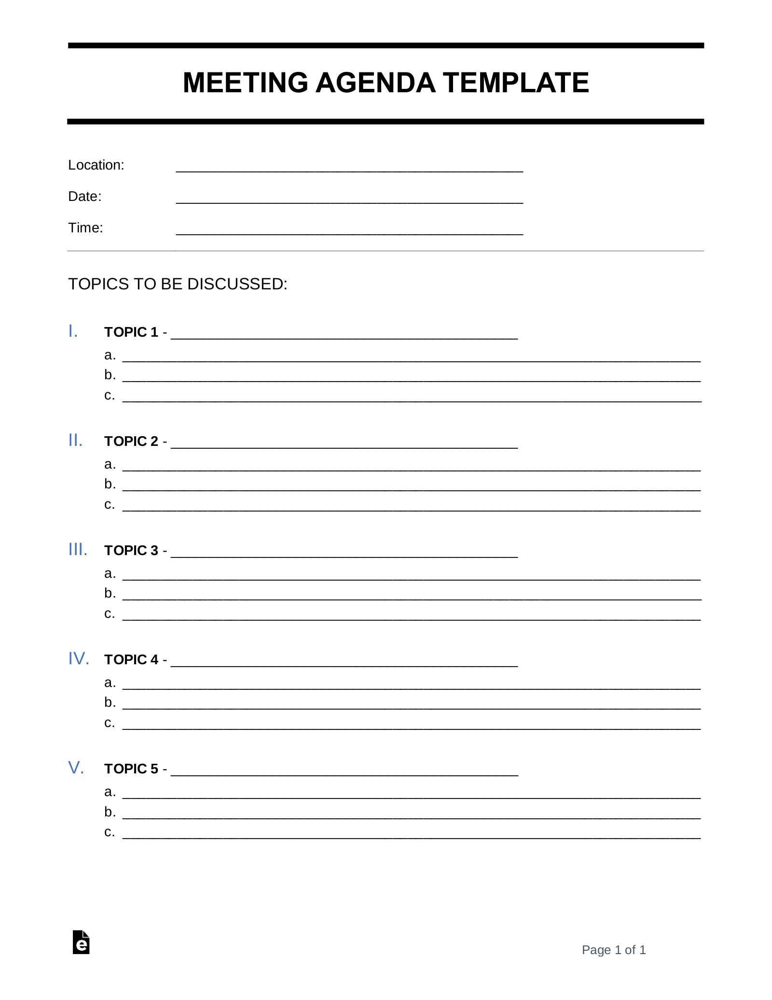
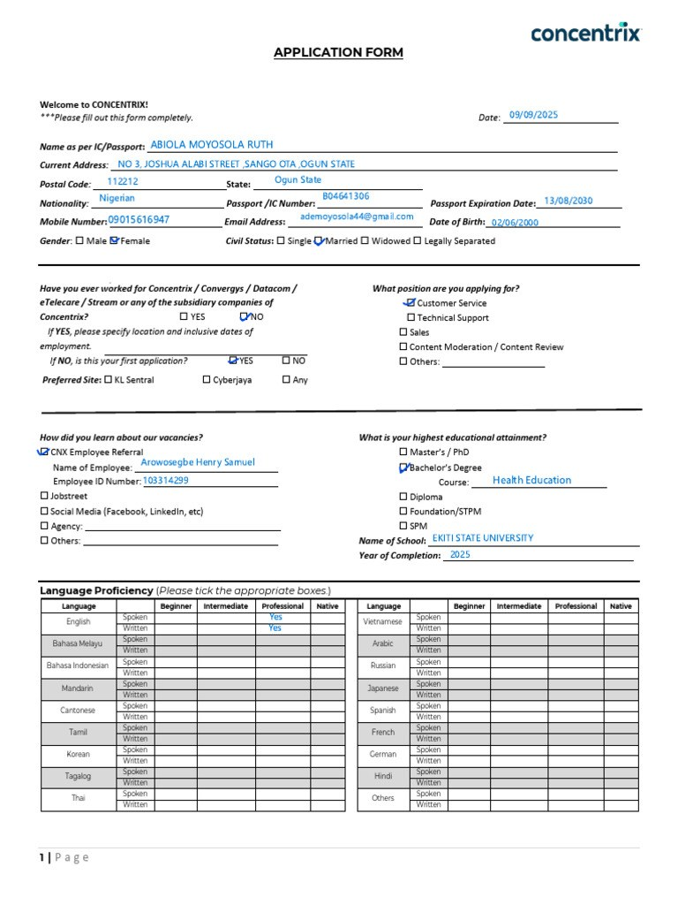
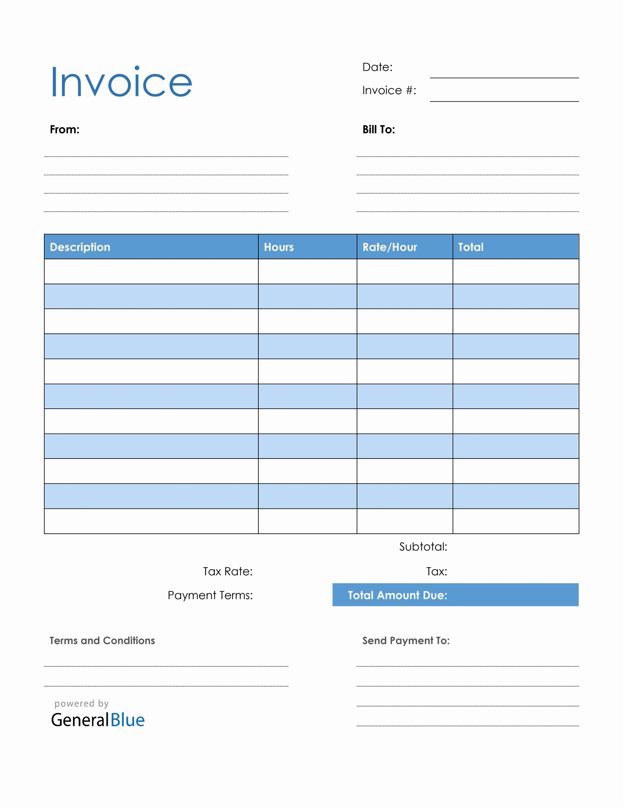
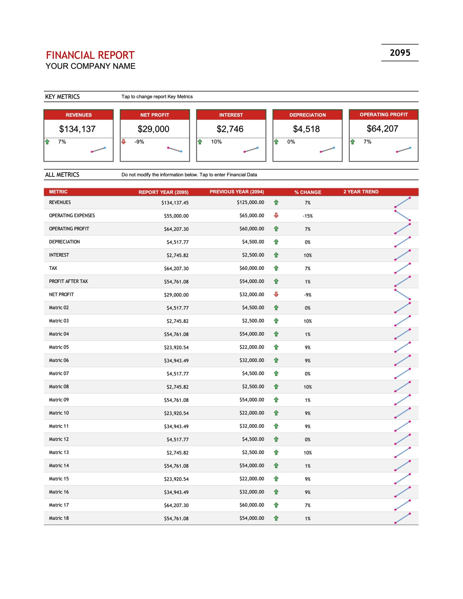
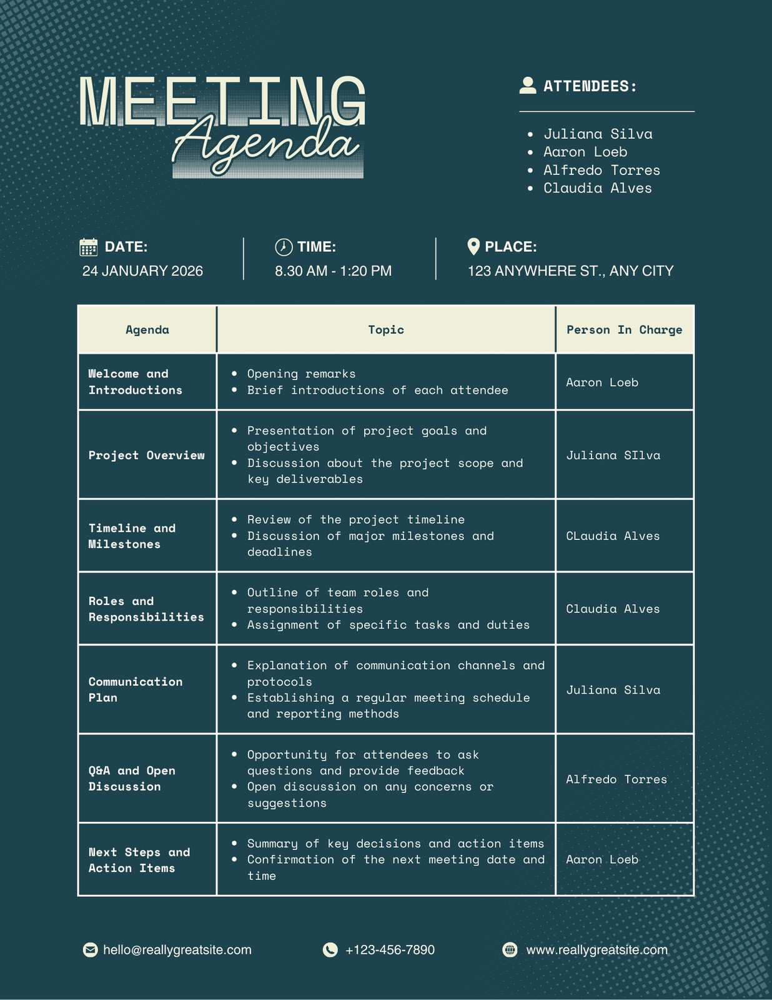

# OCR Exploration — A Small, Self-Hostable Model for Turning Documents into HTML

> **What we needed:** take a picture of a document (an agenda, form, invoice, report, or scan) and turn
> it into clean HTML that keeps both the **text and the layout** — using a model small enough to run on
> **one GPU we host ourselves**.
>
> **What we found:** we tested several PaddleOCR models against a strong baseline, **PaddleOCR-VL 1.6**,
> and then tested a small ~0.8B model called **OvisOCR2**. When a neutral AI judge compared the two on
> the same pages, it picked **OvisOCR2 over PaddleOCR-VL 1.6 on 77% of pages**. OvisOCR2 was the only
> model that actually did better than the baseline on our documents, so it's the one we now run in
> production.

---

## Table of contents

- [1. Quick summary](#1-quick-summary)
- [2. The problem](#2-the-problem)
- [3. What we tried, and how OvisOCR2 won](#3-what-we-tried-and-how-ovisocr2-won)
- [4. Every model we tested](#4-every-model-we-tested)
- [5. OvisOCR2 vs PaddleOCR-VL 1.6, head to head](#5-ovisocr2-vs-paddleocr-vl-16-head-to-head)
- [6. How we measured](#6-how-we-measured)
- [7. The dataset](#7-the-dataset)
- [8. Running it in production](#8-running-it-in-production)
- [9. What's in this repo](#9-whats-in-this-repo)
- [10. How to reproduce](#10-how-to-reproduce)
- [11. Credentials and secrets](#11-credentials-and-secrets)
- [12. Limitations](#12-limitations)

---

## 1. Quick summary

- **The goal:** a small, self-hosted model that reads a document image and returns its **text and
  layout** as HTML.
- **The baseline to beat:** **PaddleOCR-VL 1.6** — a ~0.9B model that does a great job on text, tables,
  and reading order, but is heavy: about **15 GB of GPU memory and ~23 seconds per image**.
- **What didn't work well enough:** the lighter **PP-OCRv6** models (tiny/small/medium) read text quickly
  but **don't understand layout or tables at all**. **PP-StructureV3** does rebuild tables, but it still
  **misses about a third of the text** VL captures and handles reading order less well. None of them beat
  the baseline on the full job.
- **What won:** **OvisOCR2** (`ATH-MaaS/OvisOCR2`), a small ~0.8B model that produces text, HTML tables,
  and math in **one step**. A neutral AI judge preferred it to VL 1.6 on **76.8% of pages** (VL won 21.2%,
  the rest were ties), and it won 4 of the 5 document types.
- **In production:** it runs on one **Modal L4** GPU behind a simple web API. We then made it much faster —
  roughly **4× quicker** to generate output, plus a limit that removes rare "runaway" pages, plus batching.
  It now takes about **0.7 seconds** for a simple page and **~19 seconds** for the densest ones, with a
  typical page around **7 seconds**.

## 2. The problem

We need to **read a document image and produce clean HTML** that keeps the headings, paragraphs, reading
order, and — most importantly — the **tables**. Two firm requirements:

1. **Small and self-hosted.** It has to run on a single ordinary GPU (a T4 or L4) and stay **under about
   1 billion parameters** — not a big multi-GPU model and not a paid cloud OCR service.
2. **Layout, not just text.** A plain list of recognized words isn't enough. The output has to keep the
   structure (tables and order) well enough to render as a faithful HTML page.

The first model that was good enough was **PaddleOCR-VL 1.6** — but it sits at the heavy end of what we'd
call "self-hostable" (~15 GB of GPU, ~23 seconds a page). That led to the real question:

> **Is there a model that's lighter — or simply better — than PaddleOCR-VL 1.6 for this job?**

## 3. What we tried, and how OvisOCR2 won

We looked at this in two ways.

**Way 1 — Can a lighter PaddleOCR model match VL 1.6?** (run on a Kaggle T4, in
`notebooks/ocr_vl16_comparison.ipynb`.) Because our images have no "correct answer" written down, we
treated **VL 1.6's output as the answer key** and measured how closely each lighter model matched it. We
tested **PP-OCRv6** (tiny, small, medium) and **PP-StructureV3** in four different setups.
**The result: no lighter PaddleOCR model fully replaces VL.** PP-OCRv6 gets most of VL's *words* (about
90% of them) but has no reading order or tables. PP-StructureV3 gets the *tables* but still misses about a
third of VL's text. The best of the light options was **PP-StructureV3 with the OCRv6-medium reader and
the unused parts turned off** — good, but still a trade-off, not a win over VL.

**Way 2 — Can a small general model beat VL 1.6?** (run on a Modal L4, in `experiments/ovisocr2_vs_vl/`.)
Instead of only measuring "how close to VL," we added a **neutral AI judge**: **Gemini 3.5 Flash** looks at
the original image plus *both* transcriptions (with their order shuffled so it can't tell which is which)
and picks the more accurate one. The model we tested here was **OvisOCR2**, a small ~0.8B model that
outputs text, tables, and layout in one step.
**The result: OvisOCR2 beats VL 1.6.** The judge preferred OvisOCR2 on 77% of pages — the only model in
the whole study to clearly beat the baseline on the full job, at a similarly small size.

That's why OvisOCR2 is the model we deploy (see §8).

## 4. Every model we tested

We tried a wide set — three plain-text readers, one full document pipeline in four setups, the VL baseline,
and OvisOCR2. Only **OvisOCR2** did better than PaddleOCR-VL 1.6 on our documents.

| Model | Type | Size | Reads text? | Handles layout/tables? | Cost (GPU · speed · disk) | Verdict |
|---|---|---|---|---|---|---|
| **PP-OCRv6 tiny** | Plain-text reader | 1.5 M | yes (weakest) | no | 0.88 GB · **0.28 s** · **6 MB** | Fastest and tiniest, but text only — not our job |
| **PP-OCRv6 small** | Plain-text reader | 7.7 M | yes (~90% of VL's words) | no | 2.1 GB · 0.47 s · 30 MB | Great for text only; no layout |
| **PP-OCRv6 medium** | Plain-text reader | 34.5 M | yes (best text only) | no | 3.8 GB · 0.81 s · 133 MB | ~1 point better than small for ~1.7× the cost |
| **PP-StructureV3** (4 setups) | Document pipeline (7 parts) | pipeline | partial (misses ~⅓ of VL's text) | yes, tables | 3.5–13 GB · 2.0–3.9 s · 0.9–3.9 GB | Best light trade-off, but still below VL overall |
| **PaddleOCR-VL 1.6** | Vision-language model | ~0.9 B | yes (strong) | yes (strong) | ~15 GB · ~23 s · 1.97 GB | The **baseline** — strong but heavy |
| **OvisOCR2** ⭐ | Small document model | **~0.8 B** | yes (**beats VL**) | yes (**beats VL**) | 1 L4 · ~0.7–19 s (after tuning) | **Winner — beat VL on 77% of pages** |

A few things to keep in mind:
- **PP-OCRv6 (tiny/small/medium)** only *reads text* — a flat list of lines, with no reading order or
  tables. They're very cheap (tiny is a **6 MB** model that runs in about a quarter of a second) and are
  the right choice if you ever need *text only*. But they don't do the layout half of the job. Note: the
  tiny numbers above come from the earlier **11-image** run; tiny wasn't part of the 100-image benchmark,
  where small and medium stand in as the text-only reference points.
- **PP-StructureV3** was tested in four setups (OCRv5-server vs OCRv6-medium reader, each with all parts on
  vs unused parts off). Turning off the unused parts (formula/chart/seal — our documents have none) cut it
  from **13 GB down to 3.5 GB of GPU** and **3.9 GB down to 0.86 GB on disk**, with the same or slightly
  better quality. The full run-by-run detail is in [`experiments/README.md`](experiments/README.md).
- **The PaddleOCR text/table scores here measure "how close to VL 1.6," not absolute accuracy** — because
  we used VL's output as the answer key. OvisOCR2 was judged differently: an AI judge compared it *directly
  against the original image*, which is how we can say it actually *beats* VL rather than just gets close.

**Official model pages:**
- **PaddleOCR-VL** — https://huggingface.co/PaddlePaddle/PaddleOCR-VL
- **PP-OCRv6** and **PP-StructureV3** — part of the PaddleOCR project: https://github.com/PaddlePaddle/PaddleOCR
- **OvisOCR2** — https://huggingface.co/ATH-MaaS/OvisOCR2

### Bigger models we ruled out on size

Our hard limit was **under about 1 billion parameters** — small enough to self-host cheaply on a single
GPU. We also tried some **larger open-source OCR models**, and in quick tests they did well on quality —
but they're simply **too big** for that limit, so we didn't take them into the main benchmark:

- **DeepSeek-OCR** (~3B) — https://huggingface.co/deepseek-ai/DeepSeek-OCR
- Various other **2B–7B** open-source OCR models from Hugging Face's
  [OCR Spaces](https://huggingface.co/spaces?category=ocr)

This is what makes OvisOCR2 stand out: it clears the quality bar **while staying under 1B** — the same
small size range as PaddleOCR-VL 1.6 (~0.9B).

## 5. OvisOCR2 vs PaddleOCR-VL 1.6, head to head

A neutral **Gemini 3.5 Flash** judge, over 99 pages, saw the original image plus both transcriptions (order
shuffled each time).

**Overall**

| | OvisOCR2 | PaddleOCR-VL 1.6 | Tie |
|---|---|---|---|
| **Pages won** | **76.8%** | 21.2% | 2.0% |
| Text accuracy (1–5) | **4.66** | 3.66 | — |
| Table structure (1–5) | **4.39** | 3.93 | — |
| Reading order (1–5) | **4.77** | 4.29 | — |

**The run's recommendation:** *OvisOCR2 (clear quality win).*

**By document type** — OvisOCR2 wins 4 of 5; VL only comes out ahead on the "original" scans:

| Type | Pages | OvisOCR2 wins | VL wins | Tie |
|---|---|---|---|---|
| invoice | 23 | **21** | 2 | 0 |
| agenda | 23 | **19** | 4 | 0 |
| report | 20 | **16** | 2 | 2 |
| form | 22 | **15** | 7 | 0 |
| original (scans) | 11 | 5 | **6** | 0 |

What the judge said in its page-by-page notes: OvisOCR2 tends to keep **footer and header text, and empty
table rows,** that VL leaves out, to include **form-field lines,** and to avoid VL's occasional **stray
inline CSS or extra table rows**. On the one type VL wins — the **"original"** scans — VL's wins were about
keeping **bullets and line breaks inside table cells** and avoiding some made-up text.

> **Worth knowing:** in the original benchmark, OvisOCR2 was actually *slower* than VL (about 30 s vs 24 s
> a page) and produced garbled "runaway" output on about 9% of pages. The win was on **quality**. We fixed
> the speed and the runaway pages afterward — see §8.

## 6. How we measured

**Using VL as the answer key (Way 1).** There's no human-checked correct transcription for these images, so
we treated PaddleOCR-VL 1.6's output as the reference and scored the lighter PaddleOCR models on how much
they matched it (matching words, matching characters, and how many tables they caught). This tells you how
close a cheaper model gets to VL — it can't tell you a model is *better* than VL.

**Using an AI judge (Way 2).** To ask whether OvisOCR2 is actually *better* than VL, a **Gemini 3.5 Flash**
judge looked at the **original image** plus both transcriptions and picked the more accurate one on text,
tables, and reading order, scoring each from 1 to 5. We shuffled which transcription was shown first so
position couldn't bias the result. This is the only part of the study that names a real winner rather than
just measuring similarity.

**Cost and reliability.** For every model we also recorded speed, GPU memory, disk size, load time, and
failure signs (empty output, garbled repetition, broken table HTML).

## 7. The dataset

`data/test_dataset_100/` — **100 English business documents** (plus `manifest.csv`), in five types:
**agenda, form, invoice, report, and original.** There's no human-written correct text, which is why we
used VL as the answer key and added the AI judge. The 11-image set that started the study is kept in
`experiments/11img_legacy/`.

One example from each type (from `data/test_dataset_100/`):

<p align="center">
  
  
  
  
  
</p>
<p align="center"><sub>Left to right: agenda · form · invoice · report · original</sub></p>

## 8. Running it in production

OvisOCR2 runs from **`modal_deploy/ovisocr2_app.py`** on a **Modal L4** GPU behind a simple web API. It uses
the same request and response format as the VL app (`modal_deploy/paddleocr_vl_app.py`), so one client
(`modal_deploy/test_client.py`) works with either. See [`modal_deploy/README.md`](modal_deploy/README.md).

Straight from the research setup it was slow (about 30 seconds a page on average, with a long tail). We
found the reason: almost all the time goes into *writing the output text* — reading the image itself takes
about a tenth of a second. So we fixed the text-generation side:

| Change | Effect |
|---|---|
| **Turned on CUDA graphs** | The model writes its output about **4× faster** (~35 → ~135 tokens per second on the L4) |
| **Capped the output length** (16,384 → 8,192 tokens) | Bounds the ~9% of pages that run away repeating themselves — a full runaway now caps at **~61 s** instead of ~500 s — without cutting real pages (the densest real page is ~2,500 tokens). A tested worst-case 4-image batch (a full runaway + 3 dense pages) came in at **~73 s**, safely under Modal's 150 s limit. |
| **Batching** | Several images in one request are processed together instead of one at a time |
| **Cleaner logs + HF login** | Silenced third-party warnings; the Hugging Face token comes from a shared Modal secret |

**Measured after tuning:** a simple page takes about **0.7 seconds**, a dense page about **19 seconds**
(down from 78), and a typical page around **7 seconds**. We tested the live endpoint end to end — health
check, login, single and batched images, handling of bad files, and the request limits.

## 9. What's in this repo

```
ocr_exploration/
├── data/
│   └── test_dataset_100/          100 images + manifest.csv (the benchmark set)
├── notebooks/
│   ├── ocr_vl16_comparison.ipynb  Way 1 source: PP-OCRv6 + StructureV3 vs VL 1.6
│   ├── ovisocr2_image_to_html.ipynb  OvisOCR2 (0.8B model → HTML) source
│   └── legacy/                    Earlier single-model notebooks (11-image era)
├── experiments/                   One folder per run: the run's notebook + results/
│   ├── 100img_run1_sv3_ocrv5_all/    StructureV3 baseline (OCRv5-server, all parts on)
│   ├── 100img_run2_sv3_ocrv5_lean/   StructureV3 lean (OCRv5-server, unused parts off)
│   ├── 100img_run3_sv3_ocrv6_all/    StructureV3, all parts on + OCRv6-medium
│   ├── 100img_run4_sv3_ocrv6_lean/   StructureV3 lean + OCRv6-medium (best light setup)
│   ├── ovisocr2_vs_vl/               ⭐ OvisOCR2 vs VL 1.6 — Modal L4 + Gemini judge (the winner)
│   ├── 11img_legacy/                 Earlier 11-image, 5-model experiment
│   └── README.md                     Full run-by-run write-up with settings + numbers
├── modal_deploy/                  Modal serving apps + client
│   ├── ovisocr2_app.py            ⭐ OvisOCR2 endpoint (what we run in production)
│   ├── paddleocr_vl_app.py        PaddleOCR-VL 1.6 endpoint (the baseline)
│   ├── test_client.py             Send images to either endpoint, save the HTML
│   └── README.md                  Deployment guide
├── .env.example                   Template for local secrets (copy to .env)
└── README.md                      ← you are here
```

## 10. How to reproduce

- **Way 1 (PaddleOCR):** open `notebooks/ocr_vl16_comparison.ipynb` on **Kaggle (T4)** and run it top to
  bottom. Each `experiments/100img_run*/` folder already has its finished notebook and full `results/`.
- **Way 2 (OvisOCR2 vs VL):** see `experiments/ovisocr2_vs_vl/` — a self-contained `notebook.ipynb` runs
  OvisOCR2 on a **Modal L4**, reuses the existing VL outputs, and runs the Gemini judge (needs
  `GOOGLE_API_KEY` in `.env`; about $0.10–0.15 for 100 pages).
- **Serving:** see `modal_deploy/README.md` to deploy either endpoint.

```bash
git clone <your-repo-url> ocr_exploration && cd ocr_exploration
cp .env.example .env            # then fill in your own values (see §11)
```

## 11. Credentials and secrets

No secret is ever committed — everything sensitive is listed in `.gitignore`. Bring your own:

| Secret | Where it goes | Used by |
|---|---|---|
| `GOOGLE_API_KEY` | `.env` (copy from `.env.example`) | the Gemini judge (API-key mode) |
| Vertex AI service account | `vertex-service-account.json` in the repo root | the Gemini judge in `experiments/ovisocr2_vs_vl/` (service-account mode) |
| `OCR_URL` / `OCR_TOKEN` / `OVISOCR2_TOKEN` | `.env` (the client loads it automatically) | `modal_deploy/test_client.py` |
| Modal deploy `AUTH_TOKEN` | a Modal secret (the source of truth) | the `modal_deploy/*.py` endpoints |
| `HF_TOKEN` | the shared `huggingface-secret` Modal secret | downloading model weights at deploy time |

> **If you ever commit a real key by accident:** rotate or revoke it right away — git keeps it in history
> even after you delete it.

## 12. Limitations

- **Narrow set of documents.** 100 clean English business documents — no handwriting, non-Latin scripts,
  heavy noise, or formulas/charts/seals. On the degraded **"original"** scans, VL 1.6 still edged out
  OvisOCR2.
- **The AI judge is a strong signal, not ground truth.** Gemini's page-by-page verdict is more trustworthy
  than a similarity score, but it's still a model's opinion. And the PaddleOCR numbers in Way 1 only
  measure agreement with VL, so they carry over VL's own mistakes.
- **Small sample.** 100 images is enough to rank the models clearly, but not enough for tight confidence
  intervals.
- **OvisOCR2's runaway pages.** About 9% of pages can trigger garbled repetition. Production caps this with
  a length limit (§8), but that's a safety net, not a real fix.
