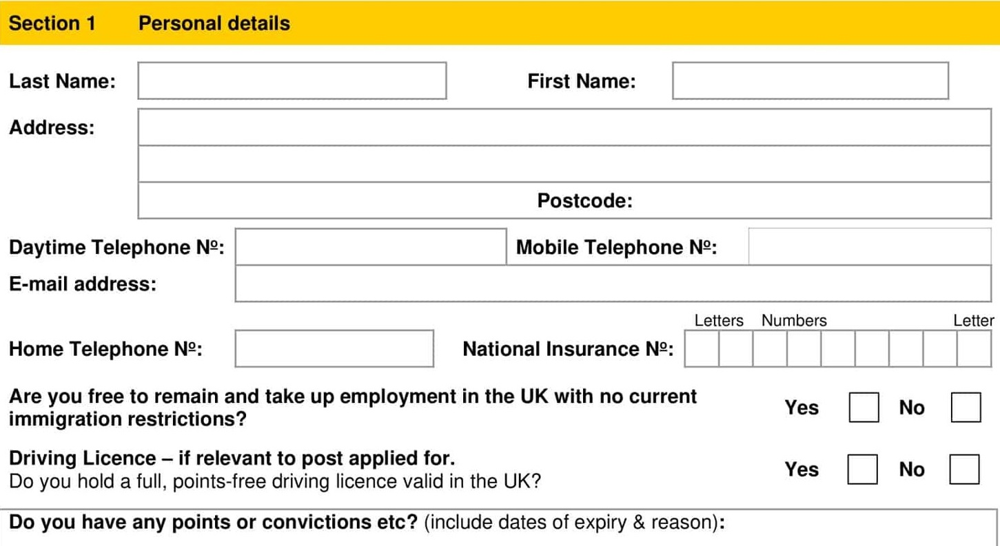

SwanMill Paper CoLtd-PennyKennedy-Castleview Enterprises Ltd-SwantexAsia 

PostLocation:

# Job Application Form 

Interview #2 Date:

Post Applied for:

Interview #1 Date:

It is important that you read theguidance notes before completing this application form.Please complete this form fully using black ink or type.CV's are notaccepted.Applications received after the closing date willnot normally be considered.

THEINFORMATIONYOUSUPPLYONTHISFORMWILLBETREATEDINCONFIDENCE.

If you are successful you will be required to provide relevant evidence of the above details prior to your appointment. Failure to comply will result in your application being terminated and/or any job offer rescinded.DrivingLicenceswill becheckatfirstinterview.

Please state current Salary Package including benefits & holidays:

www.swantex.com 