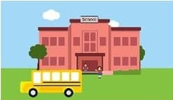

# Sessoms Elementary School  New Teacher Induction Process  Friday,February 1,20131

7:30 a.m.Arrival/Donuts & Coffee Conference Room 

7:40a.m.-8:00a.m.Shadowingof Team 2gradeLead-Gaston 5grade Lead-Lawrence 8:00-9:00 a.m.

Tourof Building/BriefIntro.to Teachers&Students 

Usher-Collier Operations 

Handbook 

Keys to Classroom 

9:00-9:20 a.m.Kronos/Leave/Forms 

9:20a.m.-10:40am.lnstructionalCoaches Meeting Unit Plan/Lesson Plan Templates Curriculum Scope and Sequences Curriculum Frameworks and Resources SharePoint Access/Online Resources Discipline Plan 

10:40-12:00 p.m.Work in Classrooms 12:00-12:30 p.m.Lunch 12:30-1:30p.m.Work in Classrooms 1:30-2:15 p.m.Meeting with Mr. Parks Mr. Sims, AP 

Mrs. Lion,

Secretary 