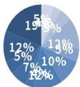

# BLUE SIMPLE FINANCIAL  ANALYSIS REPORT 

## al IncomeandExpenditureS 

<html><body><table border="1"><tr><td>department operating incomeoperating expenses net profit</td></tr><tr><td>January 230000 200000 30000</td></tr><tr><td>February 200000 180000 20000</td></tr><tr><td>March 240000 210000 30000</td></tr><tr><td>april 250000 180000 70000</td></tr><tr><td>May 190000 160000 30000</td></tr><tr><td>June 248000 190000 58000</td></tr><tr><td>july 150000 80000 70000</td></tr><tr><td>august 233000 210000 23000</td></tr><tr><td>September 110000 70000 40000</td></tr><tr><td>October 230000 200000 30000</td></tr><tr><td>november 240000 170000 70000</td></tr><tr><td>December 250000 140000 110000</td></tr><tr><td>total 2571000 1990000 581000</td></tr></table></body></html>

Annualfinancialrevenue and expenditure statistical analysis chart 

MONTHLYNET PROFITMARGIN 

|  | January | February | March | April | May|
|---|---|---|---|---|---|
|operating | 2200000 | 2400000 | 2600000 | 2700000 | 2800000|
|income | 1800000 | 2100000 | 2300000 | 2400000 | 2500000|
|net profit | 200000 | 300000 | 400000 | 500000 | 600000|

|Month | Value|
|---|---|
|January | 0|
|February | 0|
|March | 0|
|April | 0|
|May | 0|
|June | 0|
|July | 0|
|August | 0|
|September | 0|
|October | 0|
|November | 0|
|December | 0|