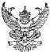

Affix Passport Size Photo

Please attach 2 photographs taken within the last 6 months (3.5 x 4.5 cm)

## APPLICATION FOR VISA

Please Indicate Type of Visa Requested

Diplomatic Visa Tick On

□ Official Visa Tick On

The Royal Thai Consulate General - Chennai Courtesy Visa Type Of Visa

Non-Immigrant Visa

Tourist Visa

□ Transit Visa

Number of Entries Requested ___

Tida Mr. □ Mrs. □ Miss Eswar Rao Konuru

First Name Middle Name Family Name (in BLOCK letters)

Former Name (if any) ___

Nationality ___ Indian

Nationality at Birth ___ Indian

Birth Place Visakhapatnam Marital Status Married

Date of Birth 15-08-1989

Type of Travel Document ___

No. Passport Number Issued at Visakhapatnam

Date Of Issue Of Passport Expiry Date Of

Date of Issue ___ Expiry Date ___ Passport ___

Wipro, Visakhapatnam

Occupation (specify present position and name of employer)

Soft Ware Engineer

Current Address D No: 15-2-18, MVP Colony.

Visakhapatnam, Andhrapradesh

Permanent Address (if different from above) ___

Same

Flight No. or Vessel's name ___

Write countries names where your passport is valid.

Duration of Proposed Stay ___ 5 days ___

Date of Previous Visit to Thailand ___

Travelling by Flight

Names, dates and places of birth of minor children (if accompanying)

Purpose of Visit:

Countries for which travel document is valid

Proposed Address In Thailand Write the address of the place in Thailand, which are going to visit

Tel. ___

Date of Arrival in Thailand 05-11-2017

Write details of minor children

___

Tel. ___ E-mail ___

□ Business Diplomatic/Official

Other (please specify) ___

Name and Address of Local Guarantor

Santhapuri Sunil Kumar

Tel/Fax 9123XXXX45

Name and Address of Guarantor in Thailand

T Vijay Mohan Rao

Tel/Fax: 9456XXXX12

I hereby declare that I will not request any refund from my paid visa fee even if my application has been declined.

Signature Applicant Signature Date 09-09-2017

Attention for Tourist and Transit Visas Applicants

I hereby declare that the purpose of my visit to Thailand is for pleasure or transit only and that in no case shall I engage myself in any profession or occupation while in the country.

Incase of Tourist visa and Transit visa.

Signature _____ Date _____

FOR OFFICIAL USE ___ at@visitum110002007

Application/Reference No. ___

Visa No. ___

Type of Visa:

Non-Immigrant Visa

Official Visa

Tourist Visa Courtesy Visa

Transit Visa

Category of Visa: ___

Number of Entries:

Single Double Multiple ___ Entries

Date of Issue ___ Fee ___

Expiry Date ___

Documents Submitted ___

___

Authorized Signature and Seal ___