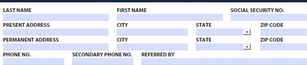
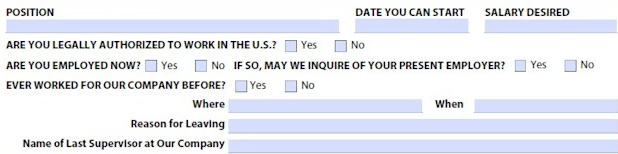

## Personal Information

## Have you been convicted of a felony or misdemeanor within the last 5 years?

## Describe

You will not be denied employment solely because of a conviction record, unless the offense is related to the job for which you have applied.

## Employment Desired

DATE YOU CAN START SALARY DESIRED

ARE YOU LEGALLY AUTHORIZED TO WORK IN THE U.S.? ☐ Ye ARE YOU EMPLOYED NOW? ☐ Yes EVER WORKED FOR OUR COMPANY BEFORE? ☐ Yes No

Name of Last Supervisor at Our Company

## Education Background

<table border=1 style='margin: auto; word-wrap: break-word;'><tr><td style='text-align: center; word-wrap: break-word;'></td><td style='text-align: center; word-wrap: break-word;'>NAME &amp; LOCATION OF SCHOOL</td><td style='text-align: center; word-wrap: break-word;'>YEARS ATTENDED</td><td style='text-align: center; word-wrap: break-word;'>DID YOU GRADUATE</td><td style='text-align: center; word-wrap: break-word;'>SUBJECTS STUDIED</td></tr><tr><td style='text-align: center; word-wrap: break-word;'>HIGH SCHOOL</td><td style='text-align: center; word-wrap: break-word;'></td><td style='text-align: center; word-wrap: break-word;'></td><td style='text-align: center; word-wrap: break-word;'></td><td style='text-align: center; word-wrap: break-word;'></td></tr><tr><td style='text-align: center; word-wrap: break-word;'>COLLEGE</td><td style='text-align: center; word-wrap: break-word;'></td><td style='text-align: center; word-wrap: break-word;'></td><td style='text-align: center; word-wrap: break-word;'></td><td style='text-align: center; word-wrap: break-word;'></td></tr><tr><td style='text-align: center; word-wrap: break-word;'>TRADE, BUSINESS, OR CORRESPONDENCE SCHOOL</td><td style='text-align: center; word-wrap: break-word;'></td><td style='text-align: center; word-wrap: break-word;'></td><td style='text-align: center; word-wrap: break-word;'></td><td style='text-align: center; word-wrap: break-word;'></td></tr></table>

SUBJECT OF SPECIAL STUDY/RESEARCH WORK SPECIAL TRANING, CERTIFICATIONS, LICENSES SPECIAL SKILLS, FOREIGN LANGUAGE, ETC.

## Military Service Record

HAVE YOU EVER SERVED IN THE U.S. ARMED FORCES? ☐ Yes ☐ No