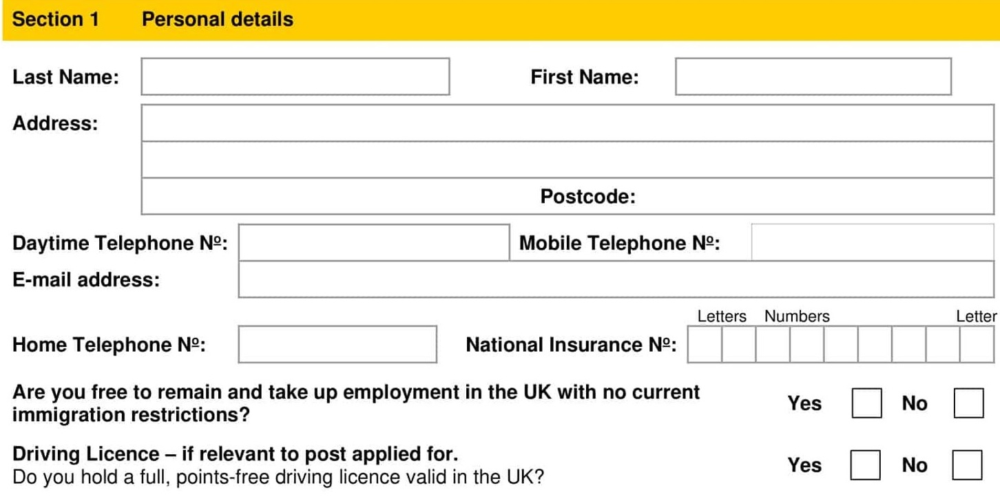

## Post Applied for:

Post Location:

## Job Application Form

Interview #1 Date:

Interview #2 Date:

It is important that you read the guidance notes before completing this application form. Please complete this form fully using black ink or type. CV's are not accepted. Applications received after the closing date will not normally be considered.

THE INFORMATION YOU SUPPLY ON THIS FORM WILL BE TREATED IN CONFIDENCE.

Do you have any points or convictions etc? (include dates of expiry & reason):

If you are successful you will be required to provide relevant evidence of the above details prior to your appointment. Failure to comply will result in your application being terminated and/or any job offer rescinded. Driving Licences will be check at first interview.

Please state current Salary Package including benefits & holidays:

