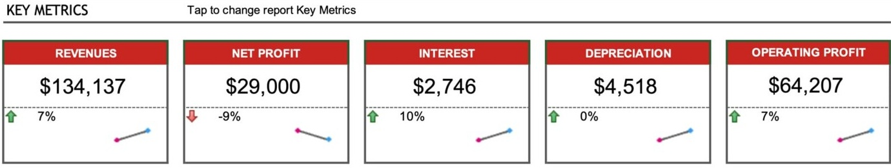

ALL METRICS

Do not modify the information below. Tap to enter Financial Data

<table border=1 style='margin: auto; word-wrap: break-word;'><tr><td style='text-align: center; word-wrap: break-word;'>METRIC</td><td style='text-align: center; word-wrap: break-word;'>REPORT YEAR (2095)</td><td style='text-align: center; word-wrap: break-word;'>PREVIOUS YEAR (2094)</td><td style='text-align: center; word-wrap: break-word;'></td><td style='text-align: center; word-wrap: break-word;'>% CHANGE</td><td style='text-align: center; word-wrap: break-word;'>2 YEAR TREND</td></tr><tr><td style='text-align: center; word-wrap: break-word;'>REVENUES</td><td style='text-align: center; word-wrap: break-word;'>134,137.45</td><td style='text-align: center; word-wrap: break-word;'>125,000.00</td><td style='text-align: center; word-wrap: break-word;'>$ \uparrow $</td><td style='text-align: center; word-wrap: break-word;'>7%</td><td style='text-align: center; word-wrap: break-word;'></td></tr><tr><td style='text-align: center; word-wrap: break-word;'>OPERATING EXPENSES</td><td style='text-align: center; word-wrap: break-word;'>55,000.00</td><td style='text-align: center; word-wrap: break-word;'>65,000.00</td><td style='text-align: center; word-wrap: break-word;'>$ \downarrow $</td><td style='text-align: center; word-wrap: break-word;'>-15%</td><td style='text-align: center; word-wrap: break-word;'></td></tr><tr><td style='text-align: center; word-wrap: break-word;'>OPERATING PROFIT</td><td style='text-align: center; word-wrap: break-word;'>64,207.30</td><td style='text-align: center; word-wrap: break-word;'>60,000.00</td><td style='text-align: center; word-wrap: break-word;'>$ \uparrow $</td><td style='text-align: center; word-wrap: break-word;'>7%</td><td style='text-align: center; word-wrap: break-word;'></td></tr><tr><td style='text-align: center; word-wrap: break-word;'>DEPRECIATION</td><td style='text-align: center; word-wrap: break-word;'>4,517.77</td><td style='text-align: center; word-wrap: break-word;'>4,500.00</td><td style='text-align: center; word-wrap: break-word;'>$ \uparrow $</td><td style='text-align: center; word-wrap: break-word;'>0%</td><td style='text-align: center; word-wrap: break-word;'></td></tr><tr><td style='text-align: center; word-wrap: break-word;'>INTEREST</td><td style='text-align: center; word-wrap: break-word;'>2,745.82</td><td style='text-align: center; word-wrap: break-word;'>2,500.00</td><td style='text-align: center; word-wrap: break-word;'>$ \uparrow $</td><td style='text-align: center; word-wrap: break-word;'>10%</td><td style='text-align: center; word-wrap: break-word;'></td></tr><tr><td style='text-align: center; word-wrap: break-word;'>TAX</td><td style='text-align: center; word-wrap: break-word;'>64,207.30</td><td style='text-align: center; word-wrap: break-word;'>60,000.00</td><td style='text-align: center; word-wrap: break-word;'>$ \uparrow $</td><td style='text-align: center; word-wrap: break-word;'>7%</td><td style='text-align: center; word-wrap: break-word;'></td></tr><tr><td style='text-align: center; word-wrap: break-word;'>PROFIT AFTER TAX</td><td style='text-align: center; word-wrap: break-word;'>54,761.08</td><td style='text-align: center; word-wrap: break-word;'>54,000.00</td><td style='text-align: center; word-wrap: break-word;'>$ \uparrow $</td><td style='text-align: center; word-wrap: break-word;'>1%</td><td style='text-align: center; word-wrap: break-word;'></td></tr><tr><td style='text-align: center; word-wrap: break-word;'>NET PROFIT</td><td style='text-align: center; word-wrap: break-word;'>29,000.00</td><td style='text-align: center; word-wrap: break-word;'>32,000.00</td><td style='text-align: center; word-wrap: break-word;'>$ \downarrow $</td><td style='text-align: center; word-wrap: break-word;'>-9%</td><td style='text-align: center; word-wrap: break-word;'></td></tr><tr><td style='text-align: center; word-wrap: break-word;'>Metric 02</td><td style='text-align: center; word-wrap: break-word;'>4,517.77</td><td style='text-align: center; word-wrap: break-word;'>4,500.00</td><td style='text-align: center; word-wrap: break-word;'>$ \uparrow $</td><td style='text-align: center; word-wrap: break-word;'>0%</td><td style='text-align: center; word-wrap: break-word;'></td></tr><tr><td style='text-align: center; word-wrap: break-word;'>Metric 03</td><td style='text-align: center; word-wrap: break-word;'>2,745.82</td><td style='text-align: center; word-wrap: break-word;'>2,500.00</td><td style='text-align: center; word-wrap: break-word;'>$ \uparrow $</td><td style='text-align: center; word-wrap: break-word;'>10%</td><td style='text-align: center; word-wrap: break-word;'></td></tr><tr><td style='text-align: center; word-wrap: break-word;'>Metric 04</td><td style='text-align: center; word-wrap: break-word;'>54,761.08</td><td style='text-align: center; word-wrap: break-word;'>54,000.00</td><td style='text-align: center; word-wrap: break-word;'>$ \uparrow $</td><td style='text-align: center; word-wrap: break-word;'>1%</td><td style='text-align: center; word-wrap: break-word;'></td></tr><tr><td style='text-align: center; word-wrap: break-word;'>Metric 05</td><td style='text-align: center; word-wrap: break-word;'>23,920.54</td><td style='text-align: center; word-wrap: break-word;'>22,000.00</td><td style='text-align: center; word-wrap: break-word;'>$ \uparrow $</td><td style='text-align: center; word-wrap: break-word;'>9%</td><td style='text-align: center; word-wrap: break-word;'></td></tr><tr><td style='text-align: center; word-wrap: break-word;'>Metric 06</td><td style='text-align: center; word-wrap: break-word;'>34,943.49</td><td style='text-align: center; word-wrap: break-word;'>32,000.00</td><td style='text-align: center; word-wrap: break-word;'>$ \uparrow $</td><td style='text-align: center; word-wrap: break-word;'>9%</td><td style='text-align: center; word-wrap: break-word;'></td></tr><tr><td style='text-align: center; word-wrap: break-word;'>Metric 07</td><td style='text-align: center; word-wrap: break-word;'>4,517.77</td><td style='text-align: center; word-wrap: break-word;'>4,500.00</td><td style='text-align: center; word-wrap: break-word;'>$ \uparrow $</td><td style='text-align: center; word-wrap: break-word;'>0%</td><td style='text-align: center; word-wrap: break-word;'></td></tr><tr><td style='text-align: center; word-wrap: break-word;'>Metric 08</td><td style='text-align: center; word-wrap: break-word;'>2,745.82</td><td style='text-align: center; word-wrap: break-word;'>2,500.00</td><td style='text-align: center; word-wrap: break-word;'>$ \uparrow $</td><td style='text-align: center; word-wrap: break-word;'>10%</td><td style='text-align: center; word-wrap: break-word;'></td></tr><tr><td style='text-align: center; word-wrap: break-word;'>Metric 09</td><td style='text-align: center; word-wrap: break-word;'>54,761.08</td><td style='text-align: center; word-wrap: break-word;'>54,000.00</td><td style='text-align: center; word-wrap: break-word;'>$ \uparrow $</td><td style='text-align: center; word-wrap: break-word;'>1%</td><td style='text-align: center; word-wrap: break-word;'></td></tr><tr><td style='text-align: center; word-wrap: break-word;'>Metric 10</td><td style='text-align: center; word-wrap: break-word;'>23,920.54</td><td style='text-align: center; word-wrap: break-word;'>22,000.00</td><td style='text-align: center; word-wrap: break-word;'>$ \uparrow $</td><td style='text-align: center; word-wrap: break-word;'>9%</td><td style='text-align: center; word-wrap: break-word;'></td></tr><tr><td style='text-align: center; word-wrap: break-word;'>Metric 11</td><td style='text-align: center; word-wrap: break-word;'>34,943.49</td><td style='text-align: center; word-wrap: break-word;'>32,000.00</td><td style='text-align: center; word-wrap: break-word;'>$ \uparrow $</td><td style='text-align: center; word-wrap: break-word;'>9%</td><td style='text-align: center; word-wrap: break-word;'></td></tr><tr><td style='text-align: center; word-wrap: break-word;'>Metric 12</td><td style='text-align: center; word-wrap: break-word;'>4,517.77</td><td style='text-align: center; word-wrap: break-word;'>4,500.00</td><td style='text-align: center; word-wrap: break-word;'>$ \uparrow $</td><td style='text-align: center; word-wrap: break-word;'>0%</td><td style='text-align: center; word-wrap: break-word;'></td></tr><tr><td style='text-align: center; word-wrap: break-word;'>Metric 13</td><td style='text-align: center; word-wrap: break-word;'>2,745.82</td><td style='text-align: center; word-wrap: break-word;'>2,500.00</td><td style='text-align: center; word-wrap: break-word;'>$ \uparrow $</td><td style='text-align: center; word-wrap: break-word;'>10%</td><td style='text-align: center; word-wrap: break-word;'></td></tr><tr><td style='text-align: center; word-wrap: break-word;'>Metric 14</td><td style='text-align: center; word-wrap: break-word;'>54,761.08</td><td style='text-align: center; word-wrap: break-word;'>54,000.00</td><td style='text-align: center; word-wrap: break-word;'>$ \uparrow $</td><td style='text-align: center; word-wrap: break-word;'>1%</td><td style='text-align: center; word-wrap: break-word;'></td></tr><tr><td style='text-align: center; word-wrap: break-word;'>Metric 15</td><td style='text-align: center; word-wrap: break-word;'>23,920.54</td><td style='text-align: center; word-wrap: break-word;'>22,000.00</td><td style='text-align: center; word-wrap: break-word;'>$ \uparrow $</td><td style='text-align: center; word-wrap: break-word;'>9%</td><td style='text-align: center; word-wrap: break-word;'></td></tr><tr><td style='text-align: center; word-wrap: break-word;'>Metric 16</td><td style='text-align: center; word-wrap: break-word;'>34,943.49</td><td style='text-align: center; word-wrap: break-word;'>32,000.00</td><td style='text-align: center; word-wrap: break-word;'>$ \uparrow $</td><td style='text-align: center; word-wrap: break-word;'>9%</td><td style='text-align: center; word-wrap: break-word;'></td></tr><tr><td style='text-align: center; word-wrap: break-word;'>Metric 17</td><td style='text-align: center; word-wrap: break-word;'>64,207.30</td><td style='text-align: center; word-wrap: break-word;'>60,000.00</td><td style='text-align: center; word-wrap: break-word;'>$ \uparrow $</td><td style='text-align: center; word-wrap: break-word;'>7%</td><td style='text-align: center; word-wrap: break-word;'></td></tr><tr><td style='text-align: center; word-wrap: break-word;'>Metric 18</td><td style='text-align: center; word-wrap: break-word;'>54,761.08</td><td style='text-align: center; word-wrap: break-word;'>54,000.00</td><td style='text-align: center; word-wrap: break-word;'>$ \uparrow $</td><td style='text-align: center; word-wrap: break-word;'>1%</td><td style='text-align: center; word-wrap: break-word;'></td></tr></table>