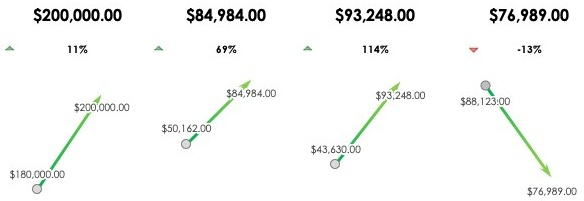

ANNUAL FINANCIAL REPORT TEMPLATE

REVENUE

OPERATING PROFIT

NET PROFIT

PROFIT AFTER TAX

<table border=1 style='margin: auto; word-wrap: break-word;'><tr><td style='text-align: center; word-wrap: break-word;'>METRIC</td><td style='text-align: center; word-wrap: break-word;'>PREVIOUS YEAR</td><td style='text-align: center; word-wrap: break-word;'>REPORT YEAR</td><td colspan="2">% OF CHANGE</td></tr><tr><td style='text-align: center; word-wrap: break-word;'>REVENUE</td><td style='text-align: center; word-wrap: break-word;'>$ 180,000.00</td><td style='text-align: center; word-wrap: break-word;'>$ 200,000.00</td><td style='text-align: center; word-wrap: break-word;'>▲</td><td style='text-align: center; word-wrap: break-word;'>11%</td></tr><tr><td style='text-align: center; word-wrap: break-word;'>OPERATING EXPENSES</td><td style='text-align: center; word-wrap: break-word;'>$ 78,897.00</td><td style='text-align: center; word-wrap: break-word;'>$ 76,971.00</td><td style='text-align: center; word-wrap: break-word;'>▼</td><td style='text-align: center; word-wrap: break-word;'>-2%</td></tr><tr><td style='text-align: center; word-wrap: break-word;'>OPERATING PRORT</td><td style='text-align: center; word-wrap: break-word;'>$ 50,162.00</td><td style='text-align: center; word-wrap: break-word;'>$ 84,984.00</td><td style='text-align: center; word-wrap: break-word;'>▲</td><td style='text-align: center; word-wrap: break-word;'>69%</td></tr><tr><td style='text-align: center; word-wrap: break-word;'>DEPRECIATION</td><td style='text-align: center; word-wrap: break-word;'>$ 11,388.00</td><td style='text-align: center; word-wrap: break-word;'>$ 11,436.00</td><td style='text-align: center; word-wrap: break-word;'>▲</td><td style='text-align: center; word-wrap: break-word;'>0%</td></tr><tr><td style='text-align: center; word-wrap: break-word;'>INTEREST</td><td style='text-align: center; word-wrap: break-word;'>$ 8,316.00</td><td style='text-align: center; word-wrap: break-word;'>$ 10,031.00</td><td style='text-align: center; word-wrap: break-word;'>▲</td><td style='text-align: center; word-wrap: break-word;'>21%</td></tr><tr><td style='text-align: center; word-wrap: break-word;'>NET PRORT</td><td style='text-align: center; word-wrap: break-word;'>$ 43,630.00</td><td style='text-align: center; word-wrap: break-word;'>$ 93,248.00</td><td style='text-align: center; word-wrap: break-word;'>▲</td><td style='text-align: center; word-wrap: break-word;'>114%</td></tr><tr><td style='text-align: center; word-wrap: break-word;'>TAX</td><td style='text-align: center; word-wrap: break-word;'>$ 73,031.00</td><td style='text-align: center; word-wrap: break-word;'>$ 68,556.00</td><td style='text-align: center; word-wrap: break-word;'>▼</td><td style='text-align: center; word-wrap: break-word;'>-6%</td></tr><tr><td style='text-align: center; word-wrap: break-word;'>PRORT AFTER TAX</td><td style='text-align: center; word-wrap: break-word;'>$ 88,123.00</td><td style='text-align: center; word-wrap: break-word;'>$ 76,989.00</td><td style='text-align: center; word-wrap: break-word;'>▼</td><td style='text-align: center; word-wrap: break-word;'>-13%</td></tr><tr><td style='text-align: center; word-wrap: break-word;'>METRIC 1</td><td style='text-align: center; word-wrap: break-word;'>$ 22.00</td><td style='text-align: center; word-wrap: break-word;'>$ 5.00</td><td style='text-align: center; word-wrap: break-word;'>▼</td><td style='text-align: center; word-wrap: break-word;'>-77%</td></tr><tr><td style='text-align: center; word-wrap: break-word;'>METRIC 2</td><td style='text-align: center; word-wrap: break-word;'>$ 12.00</td><td style='text-align: center; word-wrap: break-word;'>$ 21.00</td><td style='text-align: center; word-wrap: break-word;'>▲</td><td style='text-align: center; word-wrap: break-word;'>75%</td></tr><tr><td style='text-align: center; word-wrap: break-word;'>METRIC 3</td><td style='text-align: center; word-wrap: break-word;'>$ 17.00</td><td style='text-align: center; word-wrap: break-word;'>$ 40.00</td><td style='text-align: center; word-wrap: break-word;'>▲</td><td style='text-align: center; word-wrap: break-word;'>135%</td></tr><tr><td style='text-align: center; word-wrap: break-word;'>METRIC 4</td><td style='text-align: center; word-wrap: break-word;'>$ 2.00</td><td style='text-align: center; word-wrap: break-word;'>$ 2.00</td><td style='text-align: center; word-wrap: break-word;'>—</td><td style='text-align: center; word-wrap: break-word;'>0%</td></tr><tr><td style='text-align: center; word-wrap: break-word;'>METRIC 5</td><td style='text-align: center; word-wrap: break-word;'>$ 16.00</td><td style='text-align: center; word-wrap: break-word;'>$ 21.00</td><td style='text-align: center; word-wrap: break-word;'>▲</td><td style='text-align: center; word-wrap: break-word;'>31%</td></tr><tr><td style='text-align: center; word-wrap: break-word;'>METRIC 6</td><td style='text-align: center; word-wrap: break-word;'>$ 41.00</td><td style='text-align: center; word-wrap: break-word;'>$ 29.00</td><td style='text-align: center; word-wrap: break-word;'>▼</td><td style='text-align: center; word-wrap: break-word;'>-29%</td></tr><tr><td style='text-align: center; word-wrap: break-word;'>METRIC 7</td><td style='text-align: center; word-wrap: break-word;'>$ 25.00</td><td style='text-align: center; word-wrap: break-word;'>$ 27.00</td><td style='text-align: center; word-wrap: break-word;'>▲</td><td style='text-align: center; word-wrap: break-word;'>8%</td></tr><tr><td style='text-align: center; word-wrap: break-word;'>METRIC 8</td><td style='text-align: center; word-wrap: break-word;'>$ 1.00</td><td style='text-align: center; word-wrap: break-word;'>$ 1.00</td><td style='text-align: center; word-wrap: break-word;'>—</td><td style='text-align: center; word-wrap: break-word;'>0%</td></tr><tr><td style='text-align: center; word-wrap: break-word;'>METRIC 9</td><td style='text-align: center; word-wrap: break-word;'>$ 32.00</td><td style='text-align: center; word-wrap: break-word;'>$ 41.00</td><td style='text-align: center; word-wrap: break-word;'>▲</td><td style='text-align: center; word-wrap: break-word;'>28%</td></tr><tr><td style='text-align: center; word-wrap: break-word;'>METRIC 10</td><td style='text-align: center; word-wrap: break-word;'>$ 7.00</td><td style='text-align: center; word-wrap: break-word;'>$ 38.00</td><td style='text-align: center; word-wrap: break-word;'>▲</td><td style='text-align: center; word-wrap: break-word;'>443%</td></tr></table>