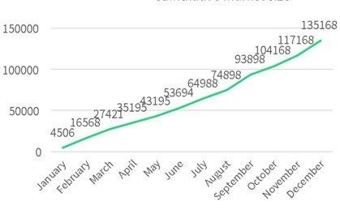
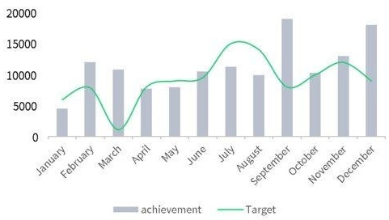
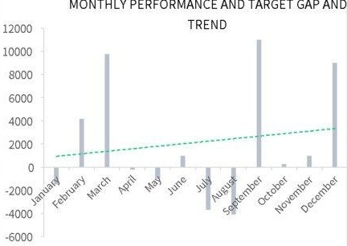

## MARKET ANALYSIS TABLE FINANCIAL REPORT

## Stock market size analysis

<table border=1 style='margin: auto; word-wrap: break-word;'><tr><td style='text-align: center; word-wrap: break-word;'>month</td><td style='text-align: center; word-wrap: break-word;'>achievement</td><td style='text-align: center; word-wrap: break-word;'>Target</td><td style='text-align: center; word-wrap: break-word;'>gap</td><td style='text-align: center; word-wrap: break-word;'>Total</td><td style='text-align: center; word-wrap: break-word;'>Market</td><td style='text-align: center; word-wrap: break-word;'>Cumulative</td></tr><tr><td style='text-align: center; word-wrap: break-word;'>January</td><td style='text-align: center; word-wrap: break-word;'>4506</td><td style='text-align: center; word-wrap: break-word;'>6000</td><td style='text-align: center; word-wrap: break-word;'>###</td><td style='text-align: center; word-wrap: break-word;'></td><td style='text-align: center; word-wrap: break-word;'></td><td style='text-align: center; word-wrap: break-word;'>4506</td></tr><tr><td style='text-align: center; word-wrap: break-word;'>February</td><td style='text-align: center; word-wrap: break-word;'>12062</td><td style='text-align: center; word-wrap: break-word;'>7900</td><td style='text-align: center; word-wrap: break-word;'>4162</td><td style='text-align: center; word-wrap: break-word;'></td><td style='text-align: center; word-wrap: break-word;'></td><td style='text-align: center; word-wrap: break-word;'>16568</td></tr><tr><td style='text-align: center; word-wrap: break-word;'>March</td><td style='text-align: center; word-wrap: break-word;'>10853</td><td style='text-align: center; word-wrap: break-word;'>1100</td><td style='text-align: center; word-wrap: break-word;'>9753</td><td style='text-align: center; word-wrap: break-word;'></td><td style='text-align: center; word-wrap: break-word;'></td><td style='text-align: center; word-wrap: break-word;'>27421</td></tr><tr><td style='text-align: center; word-wrap: break-word;'>April</td><td style='text-align: center; word-wrap: break-word;'>7774</td><td style='text-align: center; word-wrap: break-word;'>8000</td><td style='text-align: center; word-wrap: break-word;'>-226</td><td style='text-align: center; word-wrap: break-word;'></td><td style='text-align: center; word-wrap: break-word;'></td><td style='text-align: center; word-wrap: break-word;'>35195</td></tr><tr><td style='text-align: center; word-wrap: break-word;'>May</td><td style='text-align: center; word-wrap: break-word;'>8000</td><td style='text-align: center; word-wrap: break-word;'>9000</td><td style='text-align: center; word-wrap: break-word;'>###</td><td style='text-align: center; word-wrap: break-word;'></td><td style='text-align: center; word-wrap: break-word;'></td><td style='text-align: center; word-wrap: break-word;'>43195</td></tr><tr><td style='text-align: center; word-wrap: break-word;'>June</td><td style='text-align: center; word-wrap: break-word;'>10499</td><td style='text-align: center; word-wrap: break-word;'>9500</td><td style='text-align: center; word-wrap: break-word;'>999</td><td style='text-align: center; word-wrap: break-word;'></td><td style='text-align: center; word-wrap: break-word;'></td><td style='text-align: center; word-wrap: break-word;'>53694</td></tr><tr><td style='text-align: center; word-wrap: break-word;'>July</td><td style='text-align: center; word-wrap: break-word;'>11294</td><td style='text-align: center; word-wrap: break-word;'>15000</td><td style='text-align: center; word-wrap: break-word;'>###</td><td style='text-align: center; word-wrap: break-word;'></td><td style='text-align: center; word-wrap: break-word;'></td><td style='text-align: center; word-wrap: break-word;'>64988</td></tr><tr><td style='text-align: center; word-wrap: break-word;'>August</td><td style='text-align: center; word-wrap: break-word;'>9910</td><td style='text-align: center; word-wrap: break-word;'>14000</td><td style='text-align: center; word-wrap: break-word;'>###</td><td style='text-align: center; word-wrap: break-word;'></td><td style='text-align: center; word-wrap: break-word;'></td><td style='text-align: center; word-wrap: break-word;'>74898</td></tr><tr><td style='text-align: center; word-wrap: break-word;'>September</td><td style='text-align: center; word-wrap: break-word;'>19000</td><td style='text-align: center; word-wrap: break-word;'>8000</td><td style='text-align: center; word-wrap: break-word;'>###</td><td style='text-align: center; word-wrap: break-word;'></td><td style='text-align: center; word-wrap: break-word;'></td><td style='text-align: center; word-wrap: break-word;'>93898</td></tr><tr><td style='text-align: center; word-wrap: break-word;'>October</td><td style='text-align: center; word-wrap: break-word;'>10270</td><td style='text-align: center; word-wrap: break-word;'>10000</td><td style='text-align: center; word-wrap: break-word;'>270</td><td style='text-align: center; word-wrap: break-word;'></td><td style='text-align: center; word-wrap: break-word;'></td><td style='text-align: center; word-wrap: break-word;'>104168</td></tr><tr><td style='text-align: center; word-wrap: break-word;'>November</td><td style='text-align: center; word-wrap: break-word;'>13000</td><td style='text-align: center; word-wrap: break-word;'>12000</td><td style='text-align: center; word-wrap: break-word;'>1000</td><td style='text-align: center; word-wrap: break-word;'></td><td style='text-align: center; word-wrap: break-word;'></td><td style='text-align: center; word-wrap: break-word;'>117168</td></tr><tr><td style='text-align: center; word-wrap: break-word;'>December</td><td style='text-align: center; word-wrap: break-word;'>18000</td><td style='text-align: center; word-wrap: break-word;'>9000</td><td style='text-align: center; word-wrap: break-word;'>9000</td><td style='text-align: center; word-wrap: break-word;'></td><td style='text-align: center; word-wrap: break-word;'></td><td style='text-align: center; word-wrap: break-word;'>135168</td></tr></table>

## mulative market si 1E+05 or of non-stands 5

Monthly performance and target comparison

cumulative market size

MONTHLY PERFORMANCE AND TARGET GAP AND TREND

