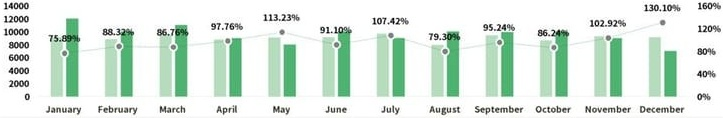
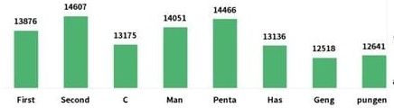
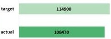

## SALES ANALYSIS ANNUAL REPORT

<table border=1 style='margin: auto; word-wrap: break-word;'><tr><td style='text-align: center; word-wrap: break-word;'>Seller</td><td style='text-align: center; word-wrap: break-word;'>January</td><td style='text-align: center; word-wrap: break-word;'>February</td><td style='text-align: center; word-wrap: break-word;'>March</td><td style='text-align: center; word-wrap: break-word;'>April</td><td style='text-align: center; word-wrap: break-word;'>May</td><td style='text-align: center; word-wrap: break-word;'>June</td><td style='text-align: center; word-wrap: break-word;'>July</td><td style='text-align: center; word-wrap: break-word;'>August</td><td style='text-align: center; word-wrap: break-word;'>September</td><td style='text-align: center; word-wrap: break-word;'>October</td><td style='text-align: center; word-wrap: break-word;'>November</td><td style='text-align: center; word-wrap: break-word;'>December</td><td style='text-align: center; word-wrap: break-word;'>total</td></tr><tr><td style='text-align: center; word-wrap: break-word;'>First</td><td style='text-align: center; word-wrap: break-word;'>974</td><td style='text-align: center; word-wrap: break-word;'>839</td><td style='text-align: center; word-wrap: break-word;'>1358</td><td style='text-align: center; word-wrap: break-word;'>883</td><td style='text-align: center; word-wrap: break-word;'>929</td><td style='text-align: center; word-wrap: break-word;'>1226</td><td style='text-align: center; word-wrap: break-word;'>1452</td><td style='text-align: center; word-wrap: break-word;'>1294</td><td style='text-align: center; word-wrap: break-word;'>1285</td><td style='text-align: center; word-wrap: break-word;'>1233</td><td style='text-align: center; word-wrap: break-word;'>975</td><td style='text-align: center; word-wrap: break-word;'>1428</td><td style='text-align: center; word-wrap: break-word;'>13876</td></tr><tr><td style='text-align: center; word-wrap: break-word;'>Second</td><td style='text-align: center; word-wrap: break-word;'>1067</td><td style='text-align: center; word-wrap: break-word;'>1493</td><td style='text-align: center; word-wrap: break-word;'>1290</td><td style='text-align: center; word-wrap: break-word;'>1150</td><td style='text-align: center; word-wrap: break-word;'>1338</td><td style='text-align: center; word-wrap: break-word;'>1149</td><td style='text-align: center; word-wrap: break-word;'>1301</td><td style='text-align: center; word-wrap: break-word;'>1101</td><td style='text-align: center; word-wrap: break-word;'>964</td><td style='text-align: center; word-wrap: break-word;'>1065</td><td style='text-align: center; word-wrap: break-word;'>1264</td><td style='text-align: center; word-wrap: break-word;'>1425</td><td style='text-align: center; word-wrap: break-word;'>14607</td></tr><tr><td style='text-align: center; word-wrap: break-word;'>C</td><td style='text-align: center; word-wrap: break-word;'>1374</td><td style='text-align: center; word-wrap: break-word;'>1260</td><td style='text-align: center; word-wrap: break-word;'>908</td><td style='text-align: center; word-wrap: break-word;'>1028</td><td style='text-align: center; word-wrap: break-word;'>1333</td><td style='text-align: center; word-wrap: break-word;'>1155</td><td style='text-align: center; word-wrap: break-word;'>1200</td><td style='text-align: center; word-wrap: break-word;'>1140</td><td style='text-align: center; word-wrap: break-word;'>875</td><td style='text-align: center; word-wrap: break-word;'>952</td><td style='text-align: center; word-wrap: break-word;'>815</td><td style='text-align: center; word-wrap: break-word;'>1135</td><td style='text-align: center; word-wrap: break-word;'>13175</td></tr><tr><td style='text-align: center; word-wrap: break-word;'>Man</td><td style='text-align: center; word-wrap: break-word;'>1338</td><td style='text-align: center; word-wrap: break-word;'>828</td><td style='text-align: center; word-wrap: break-word;'>1425</td><td style='text-align: center; word-wrap: break-word;'>1268</td><td style='text-align: center; word-wrap: break-word;'>803</td><td style='text-align: center; word-wrap: break-word;'>1406</td><td style='text-align: center; word-wrap: break-word;'>1382</td><td style='text-align: center; word-wrap: break-word;'>841</td><td style='text-align: center; word-wrap: break-word;'>1320</td><td style='text-align: center; word-wrap: break-word;'>1395</td><td style='text-align: center; word-wrap: break-word;'>1143</td><td style='text-align: center; word-wrap: break-word;'>902</td><td style='text-align: center; word-wrap: break-word;'>14051</td></tr><tr><td style='text-align: center; word-wrap: break-word;'>Penta</td><td style='text-align: center; word-wrap: break-word;'>941</td><td style='text-align: center; word-wrap: break-word;'>1419</td><td style='text-align: center; word-wrap: break-word;'>896</td><td style='text-align: center; word-wrap: break-word;'>1161</td><td style='text-align: center; word-wrap: break-word;'>1369</td><td style='text-align: center; word-wrap: break-word;'>1018</td><td style='text-align: center; word-wrap: break-word;'>1130</td><td style='text-align: center; word-wrap: break-word;'>895</td><td style='text-align: center; word-wrap: break-word;'>1392</td><td style='text-align: center; word-wrap: break-word;'>1344</td><td style='text-align: center; word-wrap: break-word;'>1452</td><td style='text-align: center; word-wrap: break-word;'>1449</td><td style='text-align: center; word-wrap: break-word;'>14466</td></tr><tr><td style='text-align: center; word-wrap: break-word;'>Has</td><td style='text-align: center; word-wrap: break-word;'>1431</td><td style='text-align: center; word-wrap: break-word;'>935</td><td style='text-align: center; word-wrap: break-word;'>1070</td><td style='text-align: center; word-wrap: break-word;'>1275</td><td style='text-align: center; word-wrap: break-word;'>1266</td><td style='text-align: center; word-wrap: break-word;'>1122</td><td style='text-align: center; word-wrap: break-word;'>1141</td><td style='text-align: center; word-wrap: break-word;'>941</td><td style='text-align: center; word-wrap: break-word;'>1224</td><td style='text-align: center; word-wrap: break-word;'>840</td><td style='text-align: center; word-wrap: break-word;'>1034</td><td style='text-align: center; word-wrap: break-word;'>857</td><td style='text-align: center; word-wrap: break-word;'>13136</td></tr><tr><td style='text-align: center; word-wrap: break-word;'>Geng</td><td style='text-align: center; word-wrap: break-word;'>1148</td><td style='text-align: center; word-wrap: break-word;'>1057</td><td style='text-align: center; word-wrap: break-word;'>1117</td><td style='text-align: center; word-wrap: break-word;'>947</td><td style='text-align: center; word-wrap: break-word;'>1038</td><td style='text-align: center; word-wrap: break-word;'>1065</td><td style='text-align: center; word-wrap: break-word;'>1145</td><td style='text-align: center; word-wrap: break-word;'>826</td><td style='text-align: center; word-wrap: break-word;'>995</td><td style='text-align: center; word-wrap: break-word;'>886</td><td style='text-align: center; word-wrap: break-word;'>1408</td><td style='text-align: center; word-wrap: break-word;'>886</td><td style='text-align: center; word-wrap: break-word;'>12518</td></tr><tr><td style='text-align: center; word-wrap: break-word;'>pungent</td><td style='text-align: center; word-wrap: break-word;'>834</td><td style='text-align: center; word-wrap: break-word;'>1001</td><td style='text-align: center; word-wrap: break-word;'>1480</td><td style='text-align: center; word-wrap: break-word;'>1086</td><td style='text-align: center; word-wrap: break-word;'>982</td><td style='text-align: center; word-wrap: break-word;'>969</td><td style='text-align: center; word-wrap: break-word;'>917</td><td style='text-align: center; word-wrap: break-word;'>892</td><td style='text-align: center; word-wrap: break-word;'>1374</td><td style='text-align: center; word-wrap: break-word;'>909</td><td style='text-align: center; word-wrap: break-word;'>1172</td><td style='text-align: center; word-wrap: break-word;'>1025</td><td style='text-align: center; word-wrap: break-word;'>12641</td></tr><tr><td style='text-align: center; word-wrap: break-word;'>total</td><td style='text-align: center; word-wrap: break-word;'>9107</td><td style='text-align: center; word-wrap: break-word;'>8832</td><td style='text-align: center; word-wrap: break-word;'>9544</td><td style='text-align: center; word-wrap: break-word;'>8798</td><td style='text-align: center; word-wrap: break-word;'>9058</td><td style='text-align: center; word-wrap: break-word;'>9110</td><td style='text-align: center; word-wrap: break-word;'>9668</td><td style='text-align: center; word-wrap: break-word;'>7930</td><td style='text-align: center; word-wrap: break-word;'>9429</td><td style='text-align: center; word-wrap: break-word;'>8624</td><td style='text-align: center; word-wrap: break-word;'>9263</td><td style='text-align: center; word-wrap: break-word;'>9107</td><td style='text-align: center; word-wrap: break-word;'>108470</td></tr><tr><td style='text-align: center; word-wrap: break-word;'>Target</td><td style='text-align: center; word-wrap: break-word;'>12000</td><td style='text-align: center; word-wrap: break-word;'>10000</td><td style='text-align: center; word-wrap: break-word;'>11000</td><td style='text-align: center; word-wrap: break-word;'>9000</td><td style='text-align: center; word-wrap: break-word;'>8000</td><td style='text-align: center; word-wrap: break-word;'>10000</td><td style='text-align: center; word-wrap: break-word;'>9000</td><td style='text-align: center; word-wrap: break-word;'>10000</td><td style='text-align: center; word-wrap: break-word;'>9900</td><td style='text-align: center; word-wrap: break-word;'>10000</td><td style='text-align: center; word-wrap: break-word;'>9000</td><td style='text-align: center; word-wrap: break-word;'>7000</td><td style='text-align: center; word-wrap: break-word;'>114900</td></tr><tr><td style='text-align: center; word-wrap: break-word;'>Completion rate</td><td style='text-align: center; word-wrap: break-word;'>75.89%</td><td style='text-align: center; word-wrap: break-word;'>88.32%</td><td style='text-align: center; word-wrap: break-word;'>86.76%</td><td style='text-align: center; word-wrap: break-word;'>97.76%</td><td style='text-align: center; word-wrap: break-word;'>113.23%</td><td style='text-align: center; word-wrap: break-word;'>91.10%</td><td style='text-align: center; word-wrap: break-word;'>107.42%</td><td style='text-align: center; word-wrap: break-word;'>79.30%</td><td style='text-align: center; word-wrap: break-word;'>95.24%</td><td style='text-align: center; word-wrap: break-word;'>86.24%</td><td style='text-align: center; word-wrap: break-word;'>102.92%</td><td style='text-align: center; word-wrap: break-word;'>130.10%</td><td style='text-align: center; word-wrap: break-word;'>94.40%</td></tr></table>

Monthly goal completion

实际Target Completion rate

Performance of each salesperson

total task completion

