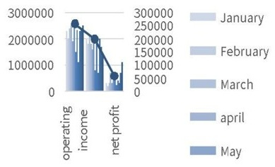
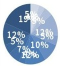
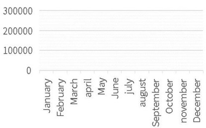
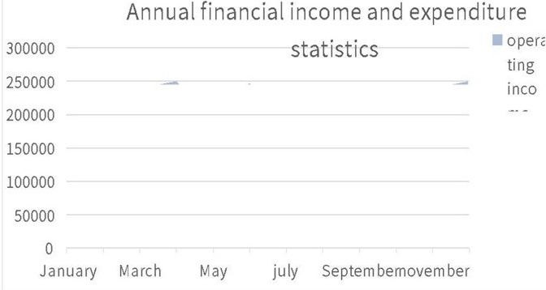

# BLUE SIMPLE FINANCIAL ANALYSIS REPORT

## Income and Expenditure

<table border=1 style='margin: auto; word-wrap: break-word;'><tr><td style='text-align: center; word-wrap: break-word;'>January</td><td style='text-align: center; word-wrap: break-word;'>230000</td><td style='text-align: center; word-wrap: break-word;'>200000</td><td style='text-align: center; word-wrap: break-word;'>30000</td></tr><tr><td style='text-align: center; word-wrap: break-word;'>February</td><td style='text-align: center; word-wrap: break-word;'>200000</td><td style='text-align: center; word-wrap: break-word;'>180000</td><td style='text-align: center; word-wrap: break-word;'>20000</td></tr><tr><td style='text-align: center; word-wrap: break-word;'>March</td><td style='text-align: center; word-wrap: break-word;'>240000</td><td style='text-align: center; word-wrap: break-word;'>210000</td><td style='text-align: center; word-wrap: break-word;'>30000</td></tr><tr><td style='text-align: center; word-wrap: break-word;'>April</td><td style='text-align: center; word-wrap: break-word;'>250000</td><td style='text-align: center; word-wrap: break-word;'>180000</td><td style='text-align: center; word-wrap: break-word;'>70000</td></tr><tr><td style='text-align: center; word-wrap: break-word;'>May</td><td style='text-align: center; word-wrap: break-word;'>190000</td><td style='text-align: center; word-wrap: break-word;'>160000</td><td style='text-align: center; word-wrap: break-word;'>30000</td></tr><tr><td style='text-align: center; word-wrap: break-word;'>June</td><td style='text-align: center; word-wrap: break-word;'>248000</td><td style='text-align: center; word-wrap: break-word;'>190000</td><td style='text-align: center; word-wrap: break-word;'>58000</td></tr><tr><td style='text-align: center; word-wrap: break-word;'>July</td><td style='text-align: center; word-wrap: break-word;'>150000</td><td style='text-align: center; word-wrap: break-word;'>80000</td><td style='text-align: center; word-wrap: break-word;'>70000</td></tr><tr><td style='text-align: center; word-wrap: break-word;'>August</td><td style='text-align: center; word-wrap: break-word;'>233000</td><td style='text-align: center; word-wrap: break-word;'>210000</td><td style='text-align: center; word-wrap: break-word;'>23000</td></tr><tr><td style='text-align: center; word-wrap: break-word;'>September</td><td style='text-align: center; word-wrap: break-word;'>110000</td><td style='text-align: center; word-wrap: break-word;'>70000</td><td style='text-align: center; word-wrap: break-word;'>40000</td></tr><tr><td style='text-align: center; word-wrap: break-word;'>October</td><td style='text-align: center; word-wrap: break-word;'>230000</td><td style='text-align: center; word-wrap: break-word;'>200000</td><td style='text-align: center; word-wrap: break-word;'>30000</td></tr><tr><td style='text-align: center; word-wrap: break-word;'>November</td><td style='text-align: center; word-wrap: break-word;'>240000</td><td style='text-align: center; word-wrap: break-word;'>170000</td><td style='text-align: center; word-wrap: break-word;'>70000</td></tr><tr><td style='text-align: center; word-wrap: break-word;'>December</td><td style='text-align: center; word-wrap: break-word;'>250000</td><td style='text-align: center; word-wrap: break-word;'>140000</td><td style='text-align: center; word-wrap: break-word;'>110000</td></tr><tr><td style='text-align: center; word-wrap: break-word;'>total</td><td style='text-align: center; word-wrap: break-word;'>2571000</td><td style='text-align: center; word-wrap: break-word;'>1990000</td><td style='text-align: center; word-wrap: break-word;'>581000</td></tr></table>

Annual financial revenue

and expenditure statistical

analysis chart

MONTHLY NET

PROFIT MARGIN

Monthly financial revenue and expenditure statistical trend analysis

Annual financial income and expenditure

