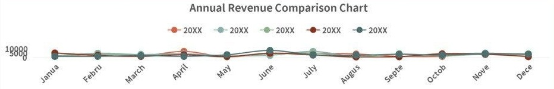

# SUMMARY OF ANNUAL FINANCIAL STATEMENTS

annual financial statement

<table border=1 style='margin: auto; word-wrap: break-word;'><tr><td style='text-align: center; word-wrap: break-word;'>serial number</td><td style='text-align: center; word-wrap: break-word;'>20XX</td><td style='text-align: center; word-wrap: break-word;'>20XX</td><td style='text-align: center; word-wrap: break-word;'>20XX</td><td style='text-align: center; word-wrap: break-word;'>20XX</td><td style='text-align: center; word-wrap: break-word;'>20XX</td><td style='text-align: center; word-wrap: break-word;'>17-16 year-on-year</td><td style='text-align: center; word-wrap: break-word;'>18-17 YoY</td><td style='text-align: center; word-wrap: break-word;'>19-18 YoY</td><td style='text-align: center; word-wrap: break-word;'>20-19 YoY</td></tr><tr><td style='text-align: center; word-wrap: break-word;'>January</td><td style='text-align: center; word-wrap: break-word;'>1296</td><td style='text-align: center; word-wrap: break-word;'>1934</td><td style='text-align: center; word-wrap: break-word;'>1049</td><td style='text-align: center; word-wrap: break-word;'>4953</td><td style='text-align: center; word-wrap: break-word;'>1213</td><td style='text-align: center; word-wrap: break-word;'>49.23%</td><td style='text-align: center; word-wrap: break-word;'>-45.76%</td><td style='text-align: center; word-wrap: break-word;'>372.16%</td><td style='text-align: center; word-wrap: break-word;'>-75.51%</td></tr><tr><td style='text-align: center; word-wrap: break-word;'>February</td><td style='text-align: center; word-wrap: break-word;'>1677</td><td style='text-align: center; word-wrap: break-word;'>4866</td><td style='text-align: center; word-wrap: break-word;'>3541</td><td style='text-align: center; word-wrap: break-word;'>2487</td><td style='text-align: center; word-wrap: break-word;'>1283</td><td style='text-align: center; word-wrap: break-word;'>190.16%</td><td style='text-align: center; word-wrap: break-word;'>-27.23%</td><td style='text-align: center; word-wrap: break-word;'>-29.77%</td><td style='text-align: center; word-wrap: break-word;'>-48.41%</td></tr><tr><td style='text-align: center; word-wrap: break-word;'>March</td><td style='text-align: center; word-wrap: break-word;'>1473</td><td style='text-align: center; word-wrap: break-word;'>3460</td><td style='text-align: center; word-wrap: break-word;'>2396</td><td style='text-align: center; word-wrap: break-word;'>1151</td><td style='text-align: center; word-wrap: break-word;'>2081</td><td style='text-align: center; word-wrap: break-word;'>134.89%</td><td style='text-align: center; word-wrap: break-word;'>-30.75%</td><td style='text-align: center; word-wrap: break-word;'>-51.96%</td><td style='text-align: center; word-wrap: break-word;'>80.80%</td></tr><tr><td style='text-align: center; word-wrap: break-word;'>April</td><td style='text-align: center; word-wrap: break-word;'>6788</td><td style='text-align: center; word-wrap: break-word;'>4133</td><td style='text-align: center; word-wrap: break-word;'>2923</td><td style='text-align: center; word-wrap: break-word;'>3023</td><td style='text-align: center; word-wrap: break-word;'>1174</td><td style='text-align: center; word-wrap: break-word;'>-39.11%</td><td style='text-align: center; word-wrap: break-word;'>-29.28%</td><td style='text-align: center; word-wrap: break-word;'>3.42%</td><td style='text-align: center; word-wrap: break-word;'>-61.16%</td></tr><tr><td style='text-align: center; word-wrap: break-word;'>May</td><td style='text-align: center; word-wrap: break-word;'>779</td><td style='text-align: center; word-wrap: break-word;'>1760</td><td style='text-align: center; word-wrap: break-word;'>678</td><td style='text-align: center; word-wrap: break-word;'>1043</td><td style='text-align: center; word-wrap: break-word;'>3121</td><td style='text-align: center; word-wrap: break-word;'>125.93%</td><td style='text-align: center; word-wrap: break-word;'>-61.48%</td><td style='text-align: center; word-wrap: break-word;'>53.83%</td><td style='text-align: center; word-wrap: break-word;'>199.23%</td></tr><tr><td style='text-align: center; word-wrap: break-word;'>June</td><td style='text-align: center; word-wrap: break-word;'>4591</td><td style='text-align: center; word-wrap: break-word;'>2467</td><td style='text-align: center; word-wrap: break-word;'>4178</td><td style='text-align: center; word-wrap: break-word;'>4904</td><td style='text-align: center; word-wrap: break-word;'>7888</td><td style='text-align: center; word-wrap: break-word;'>-46.26%</td><td style='text-align: center; word-wrap: break-word;'>69.36%</td><td style='text-align: center; word-wrap: break-word;'>17.38%</td><td style='text-align: center; word-wrap: break-word;'>60.85%</td></tr><tr><td style='text-align: center; word-wrap: break-word;'>July</td><td style='text-align: center; word-wrap: break-word;'>4668</td><td style='text-align: center; word-wrap: break-word;'>6888</td><td style='text-align: center; word-wrap: break-word;'>4971</td><td style='text-align: center; word-wrap: break-word;'>2700</td><td style='text-align: center; word-wrap: break-word;'>3038</td><td style='text-align: center; word-wrap: break-word;'>47.56%</td><td style='text-align: center; word-wrap: break-word;'>-27.83%</td><td style='text-align: center; word-wrap: break-word;'>-45.68%</td><td style='text-align: center; word-wrap: break-word;'>12.52%</td></tr><tr><td style='text-align: center; word-wrap: break-word;'>August</td><td style='text-align: center; word-wrap: break-word;'>3779</td><td style='text-align: center; word-wrap: break-word;'>688</td><td style='text-align: center; word-wrap: break-word;'>678</td><td style='text-align: center; word-wrap: break-word;'>557</td><td style='text-align: center; word-wrap: break-word;'>2572</td><td style='text-align: center; word-wrap: break-word;'>-81.79%</td><td style='text-align: center; word-wrap: break-word;'>-1.45%</td><td style='text-align: center; word-wrap: break-word;'>-17.85%</td><td style='text-align: center; word-wrap: break-word;'>361.76%</td></tr><tr><td style='text-align: center; word-wrap: break-word;'>September</td><td style='text-align: center; word-wrap: break-word;'>1261</td><td style='text-align: center; word-wrap: break-word;'>578</td><td style='text-align: center; word-wrap: break-word;'>4019</td><td style='text-align: center; word-wrap: break-word;'>1012</td><td style='text-align: center; word-wrap: break-word;'>3636</td><td style='text-align: center; word-wrap: break-word;'>-54.16%</td><td style='text-align: center; word-wrap: break-word;'>595.33%</td><td style='text-align: center; word-wrap: break-word;'>-74.82%</td><td style='text-align: center; word-wrap: break-word;'>259.29%</td></tr><tr><td style='text-align: center; word-wrap: break-word;'>October</td><td style='text-align: center; word-wrap: break-word;'>1194</td><td style='text-align: center; word-wrap: break-word;'>3451</td><td style='text-align: center; word-wrap: break-word;'>1919</td><td style='text-align: center; word-wrap: break-word;'>4054</td><td style='text-align: center; word-wrap: break-word;'>2625</td><td style='text-align: center; word-wrap: break-word;'>189.03%</td><td style='text-align: center; word-wrap: break-word;'>-44.39%</td><td style='text-align: center; word-wrap: break-word;'>111.26%</td><td style='text-align: center; word-wrap: break-word;'>-35.25%</td></tr><tr><td style='text-align: center; word-wrap: break-word;'>November</td><td style='text-align: center; word-wrap: break-word;'>4816</td><td style='text-align: center; word-wrap: break-word;'>4879</td><td style='text-align: center; word-wrap: break-word;'>3524</td><td style='text-align: center; word-wrap: break-word;'>3603</td><td style='text-align: center; word-wrap: break-word;'>4154</td><td style='text-align: center; word-wrap: break-word;'>1.31%</td><td style='text-align: center; word-wrap: break-word;'>-27.77%</td><td style='text-align: center; word-wrap: break-word;'>2.24%</td><td style='text-align: center; word-wrap: break-word;'>15.29%</td></tr><tr><td style='text-align: center; word-wrap: break-word;'>December</td><td style='text-align: center; word-wrap: break-word;'>2829</td><td style='text-align: center; word-wrap: break-word;'>2722</td><td style='text-align: center; word-wrap: break-word;'>2841</td><td style='text-align: center; word-wrap: break-word;'>881</td><td style='text-align: center; word-wrap: break-word;'>3911</td><td style='text-align: center; word-wrap: break-word;'>-3.78%</td><td style='text-align: center; word-wrap: break-word;'>4.37%</td><td style='text-align: center; word-wrap: break-word;'>-68.99%</td><td style='text-align: center; word-wrap: break-word;'>343.93%</td></tr><tr><td style='text-align: center; word-wrap: break-word;'>total</td><td style='text-align: center; word-wrap: break-word;'>35151</td><td style='text-align: center; word-wrap: break-word;'>37826</td><td style='text-align: center; word-wrap: break-word;'>32717</td><td style='text-align: center; word-wrap: break-word;'>30368</td><td style='text-align: center; word-wrap: break-word;'>36696</td><td style='text-align: center; word-wrap: break-word;'>7.61%</td><td style='text-align: center; word-wrap: break-word;'>-13.51%</td><td style='text-align: center; word-wrap: break-word;'>-7.18%</td><td style='text-align: center; word-wrap: break-word;'>20.84%</td></tr><tr><td style='text-align: center; word-wrap: break-word;'>Target</td><td style='text-align: center; word-wrap: break-word;'>35000</td><td style='text-align: center; word-wrap: break-word;'>35000</td><td style='text-align: center; word-wrap: break-word;'>35000</td><td style='text-align: center; word-wrap: break-word;'>35000</td><td style='text-align: center; word-wrap: break-word;'>35000</td><td style='text-align: center; word-wrap: break-word;'>10%</td><td style='text-align: center; word-wrap: break-word;'>10%</td><td style='text-align: center; word-wrap: break-word;'>10%</td><td style='text-align: center; word-wrap: break-word;'>10%</td></tr><tr><td style='text-align: center; word-wrap: break-word;'>Completion rate</td><td style='text-align: center; word-wrap: break-word;'>100.43%</td><td style='text-align: center; word-wrap: break-word;'>108.07%</td><td style='text-align: center; word-wrap: break-word;'>93.48%</td><td style='text-align: center; word-wrap: break-word;'>86.77%</td><td style='text-align: center; word-wrap: break-word;'>104.85%</td><td style='text-align: center; word-wrap: break-word;'>76.10%</td><td style='text-align: center; word-wrap: break-word;'>-135.07%</td><td style='text-align: center; word-wrap: break-word;'>-71.80%</td><td style='text-align: center; word-wrap: break-word;'>208.38%</td></tr></table>

