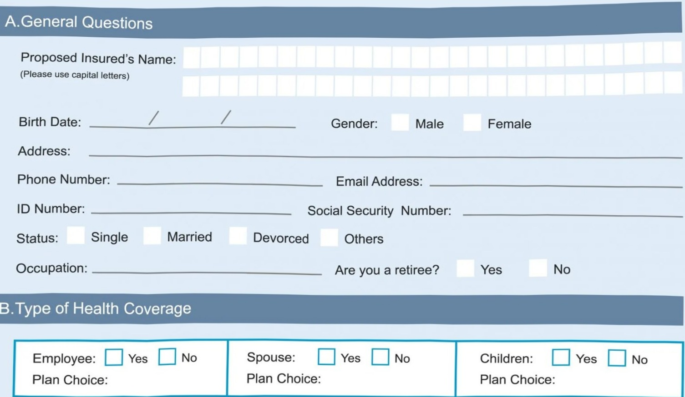
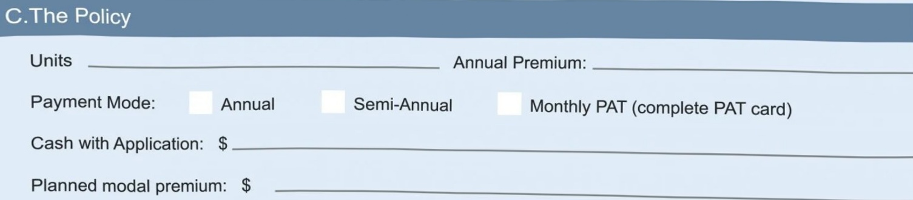

# APPLICATION FORM 

Complete If Spouse/Children are Proposed for Insurance:

<html><body><table border="1"><tr><td>Name</td><td>SSN No.</td><td>Relationship to proposed insured</td><td>Birth Date</td><td>Age</td><td>Sex</td></tr><tr><td></td><td></td><td></td><td></td><td></td><td></td></tr><tr><td></td><td></td><td></td><td></td><td></td><td></td></tr><tr><td></td><td></td><td></td><td></td><td></td><td></td></tr><tr><td></td><td></td><td></td><td></td><td></td><td></td></tr></table></body></html>

Signature:

## Terms & Conditions 

Improvement should be measured regularly and assessed in order for you to know what's beneficial and what is not. This will help you set new targets.

Date: