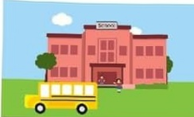

# Sessoms Elementary School  New Teacher Induction Process  Friday, February 1, 2013

7:30 a.m.Arrival/Donuts & Coffee Conference Room 

7:40 a.m.-8:00 a.m. Shadowing of Team 2dgrade Lead-Gaston 5grade Lead-Lawrence 8:00-9:00 a.m.

Tour of Building/ Brief Intro. to Teachers & Students 

Usher-Collier Operations 

Handbook 

Keys to Classroom 

:00-9:20 a.m.Kronos/Leave/Forms 

20 a.m.-10:40 a.m. Instructional Coaches Meeting Unit Plan/Lesson Plan Templates Curriculum Scope and Sequences Curriculum Frameworks and Resources SharePoint Access/Online Resources Discipline Plan 

0:40-12:00 p.m.Work in Classrooms 2:00-12:30 p.m.Lunch 2:30-1:30 p.m.Work in Classrooms 1:30-2:15 p.m.Meeting with Mr. Parks Mr. Sims, AP 

Mrs. Lion,Secretary 