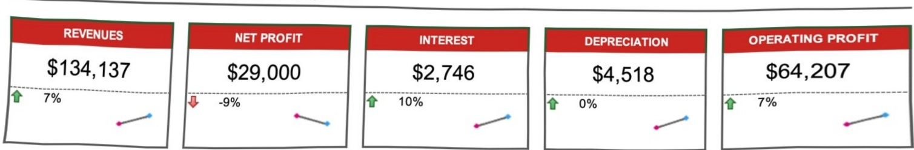

KEY METRICS 

Tap to change report Key Metrics 

ALL METRICS 

Do not modify the information below. Tap to enter Financial Data 

<html><body><table border="1"><tbody><tr><td>METRIC</td><td>REPORT YEAR (2095)</td><td>PREVIOUS YEAR (2094)</td><td>% CHANGE</td><td>2 YEAR TREND</td><td></td></tr><tr><td>REVENUES</td><td>$134,137.45</td><td>$125,000.00 ↑</td><td>7%</td><td></td><td></td></tr><tr><td>OPERATING EXPENSES</td><td>$55,000.00</td><td>$65,000.00</td><td>-15%</td><td></td><td></td></tr><tr><td>OPERATING PROFIT</td><td>$64,207.30</td><td>$60,000.00</td><td>7%</td><td></td><td></td></tr><tr><td>DEPRECIATION</td><td>$4,517.77</td><td>$4,500.00</td><td>0%</td><td></td><td>INTEREST</td></tr><tr><td>TAX</td><td>$64,207.30</td><td>$60,000.00</td><td>7%</td><td></td><td></td></tr><tr><td>PROFIT AFTER TAX</td><td>$54,761.08</td><td>$54,000.00</td><td>1%</td><td></td><td></td></tr><tr><td>NET PROFIT</td><td>$29,000.00</td><td>$32,000.00</td><td>%6-</td><td></td><td></td></tr><tr><td>atc 02</td><td>$4.57.7</td><td>45.00</td><td>%0</td><td></td><td></td></tr><tr><td>atc 03</td><td>275.82</td><td>250.00</td><td>10%</td><td></td><td>Matric 04</td></tr><tr><td>Matric 05</td><td>$23,920.54</td><td>$22,000.00</td><td>9%</td><td></td><td></td></tr><tr><td>Matric 06</td><td>$34,943.49</td><td>$32,000.00</td><td>9%</td><td></td><td></td></tr><tr><td>Matric 07</td><td>$4,517.77</td><td>$4,500.00</td><td>0%</td><td></td><td></td></tr><tr><td>Matric 08</td><td>$2,745.82</td><td>$2,500.00</td><td>10%</td><td></td><td></td></tr><tr><td>Matric 09</td><td>$54,761.08</td><td>$54,000.00</td><td>1%</td><td></td><td>Matric 10</td></tr><tr><td>Matric 11</td><td>$34,943.49</td><td>$32,000.00</td><td>9%</td><td></td><td></td></tr><tr><td>Matric 12</td><td>$4,517.77</td><td>$4,500.00</td><td>0%</td><td></td><td></td></tr><tr><td>Matric 13</td><td>$2,745.82</td><td>$2,500.00</td><td>10%</td><td></td><td></td></tr><tr><td>Matric 14</td><td>$54,761.08</td><td>$54,000.00</td><td>1%</td><td></td><td></td></tr><tr><td>Matric 15</td><td>$23,920.54</td><td>$22,000.00</td><td>9%</td><td></td><td>Matric 16</td></tr><tr><td>Matric 17</td><td>$64,207.30</td><td>$60,000.00</td><td>7%</td><td></td><td></td></tr><tr><td>Matric 18</td><td>$54,761.08</td><td>$54,000.00</td><td>1%</td><td></td><td></td></tr><tr><td></td><td></td><td></td><td></td><td></td><td></td></tr><tr><td></td><td></td><td></td><td></td><td></td><td></td></tr><tr><td></td><td></td><td></td><td></td><td></td><td></td></tr><tr><td></td><td></td><td></td><td></td><td></td><td></td></tr></tbody></table></body></html>

