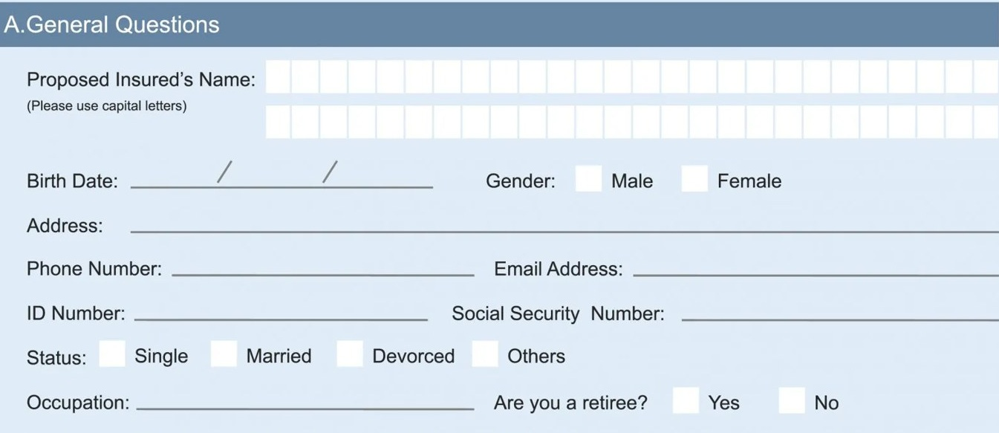

# APPLICATION FORM 

### B.Type of Health Coverage 

<html><body><table border="1"><tr><td>Employee: Yes No Plan Choice:</td><td>Spouse: Yes No Plan Choice:</td><td>Children: Yes No Plan Choice:</td></tr></table></body></html>

Complete If Spouse/Children are Proposed for Insurance:

<html><body><table border="1"><tbody><tr><td>Name</td><td>SSN No.</td><td>Relationship to proposed insured</td><td>Birth Date</td><td>Age</td><td>Sex</td></tr><tr><td></td><td></td><td></td><td></td><td></td><td></td></tr><tr><td></td><td></td><td></td><td></td><td></td><td></td></tr><tr><td></td><td></td><td></td><td></td><td></td><td></td></tr><tr><td></td><td></td><td></td><td></td><td></td><td></td></tr></tbody></table></body></html>

### C.The Policy 

<html><body><table border="1"><tr><td colspan="3">Units</td><td colspan="2">Annual Premium:</td></tr><tr><td></td><td></td><td>Semi-Annual</td><td></td><td></td></tr><tr><td>Payment Mode:</td><td>Annual</td><td></td><td>Monthly PAT (complete PAT card)</td><td></td></tr><tr><td colspan="5">Cash with Application: $</td></tr><tr><td colspan="5">Planned modal premium:</td></tr></table></body></html>

Signature:

## Terms & Conditions 

Improvement should be measured regularly and assessed in order for you to know what's beneficial and what is not. This wil help you set new targets.

Date:

