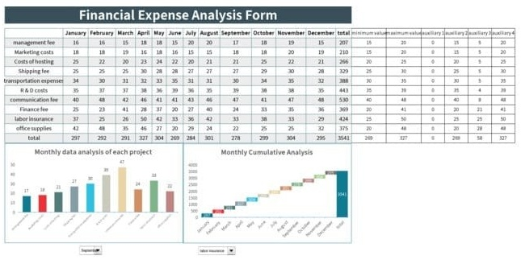

# MONTHLYFINANCIAL  ANALYSIS REPORT DOCUMENT 

<html><body><table border="1"><tbody><tr><td>Januery</td></tr><tr><td>February</td></tr><tr><td>March</td></tr><tr><td>Apill</td></tr><tr><td>slay</td></tr><tr><td>June</td></tr><tr><td>July</td></tr><tr><td>August</td></tr><tr><td>September</td></tr><tr><td>October</td></tr><tr><td>Nowember</td></tr><tr><td>December</td></tr><tr><td></td></tr><tr><td></td></tr><tr><td></td></tr><tr><td>Costs of hosting</td></tr><tr><td></td></tr><tr><td></td></tr><tr><td></td></tr><tr><td>R & D costs</td></tr><tr><td></td></tr><tr><td>Finance fee</td></tr><tr><td></td></tr><tr><td>office supplies</td></tr></tbody></table></body></html>

